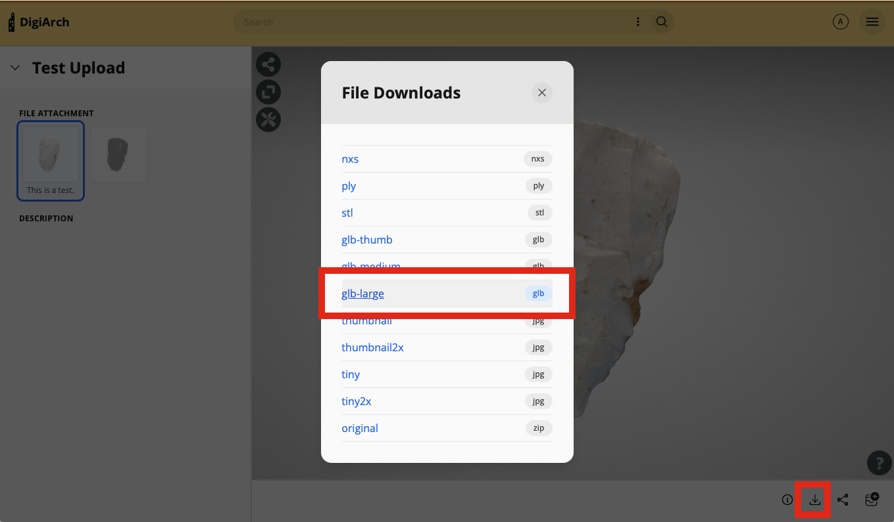

# 3D Models

Elevator supports two different 3D viewers, the [3DHop](https://3dhop.net) viewer from the [Visual Computing Lab](http://vcg.isti.cnr.it) at CNR-ISTI, as well as [Voyager](https://smithsonian.github.io/dpo-voyager/) from the Smithsonian. 3DHop is the default, but Voyager can be enabled on an instance-by-instance basis in the Instance Settings. 

The default mode for Voyager is a 3D model viewer with some basic tools for sliding and measurement. However, Voyager supports much more sophisticated annotation and tour-building. Currently, using these steps with Elevator requires a few extra steps. Eventually we hope to streamline these.

## Model Prep

Begin by uploading your model into an Elevator asset. In general, models should be zip files container OBJ, MTL and texture files. 

Once Elevator processes your model (this can take a few minutes) you should be able to see a basic 3D view on the asset page.

Now, use the "download derivatives" button and download the GLB-Large file.



## Tour/Annotation Creation

In your browser, load the [Voyager Story Standalone](https://3d.si.edu/voyager-story-standalone) application. This is the tool for building tours. Drag and drop your GLB file into the Story tool. When it prompts you for a derivative quality, select "High".

Now, add any tours, annotations, or other features to your model. Currently, the "articles" feature isn't supported, but we're looking at options for that going forward. Instead, you can link to other websites to share more content - you can use the "extended" annotation type and then put links in the "Lead" section, using standard HTML:
```
<a href="http://www.whyshouldivisit.com">Why Should I Visit?</a>
```

When you've completed your work, click the download button in the upper right to download the finished scene. That will download a zip file.

## Adding the Scene to Elevator

Go back into the Edit view for your asset. Unzip the file that was downloaded by Voyager Story. Use the "Load from File" button in Elevator to select the SVX file from the Voyager Story and load that into your Elevator asset. 