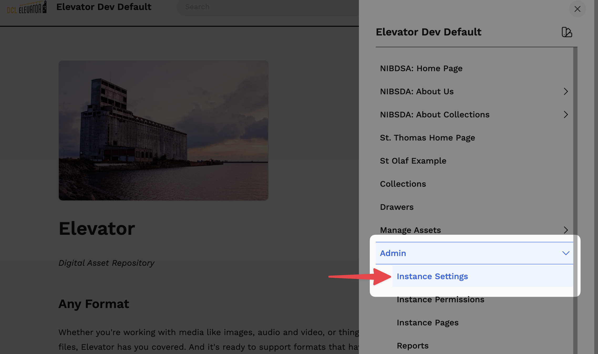
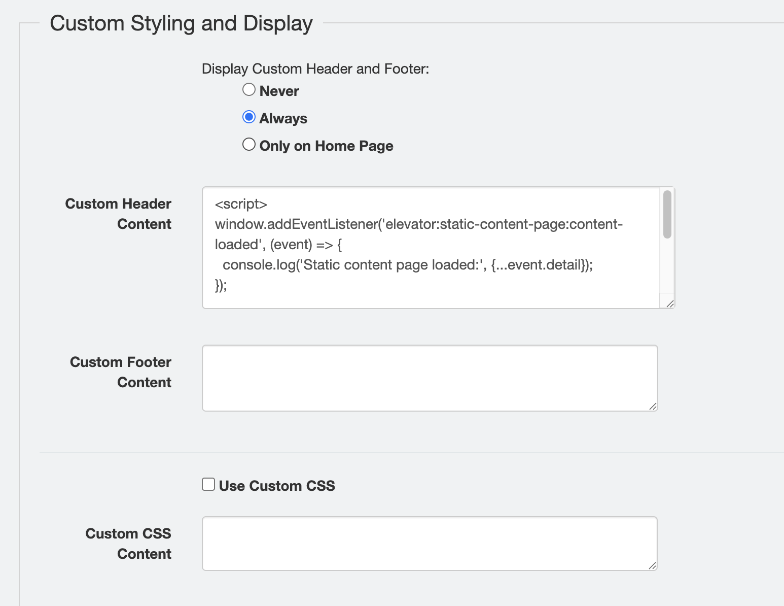
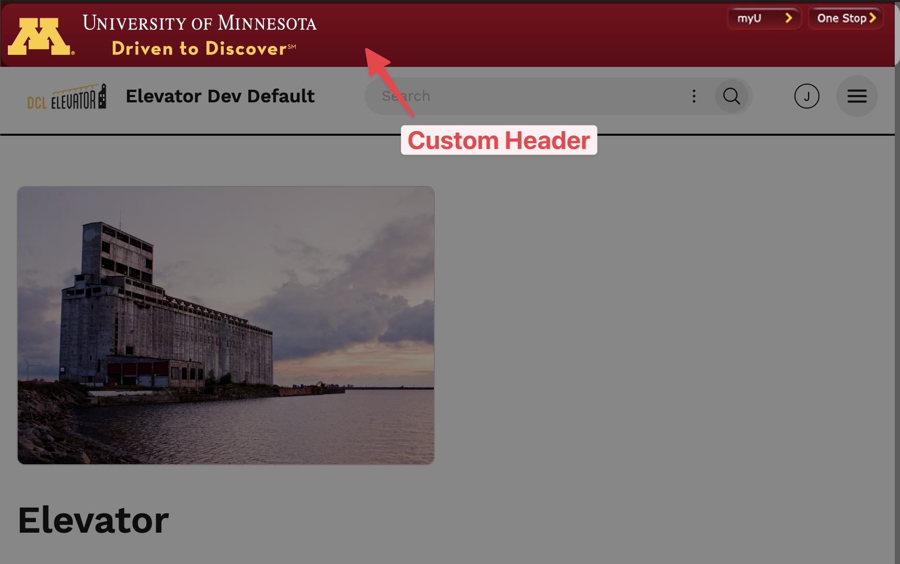

# Adding Custom Code

Elevator allows administrators to add custom HTML, CSS, and JavaScript to enhance or customize the user interface. These features are only available to **instance administrators**.

To add a custom header, footer, or CSS to Elevator, go to: `Menu > Admin > Instance Settings`. 





## Custom Header and Footer

A custom header/footer is useful for adding institutional branding, banners you want your users to see, or event [custom JavaScript](#custom-javascript).

To include a custom header/footer to your Elevator instance, add the HTML, CSS, or JavaScript code in the textarea.



**Display Options**

- *Never (default)*: custom header and footer will never appear
- *Always*: The custom header and footer will appear on every static page.
- *Only on Home Page*: the custom header/footer will only be rendered on the home page 

## Using Custom JavaScript in the VueJS Interface

Elevator's VueJS interface is built as a Single-Page Application (SPA), which means pages load dynamically without full page refreshes. This has important implications for custom javascript:

- Standard browser events like `DOMContentLoaded` and `window.load` only fire once when the application first loads,
- Navigating between pages doesn't trigger these events again.

To solve this, Elevator provides [**custom JavaScript events**](https://developer.mozilla.org/en-US/docs/Web/API/CustomEvent/CustomEvent) that fire whenever page content loads. These events allow your custom code to respond to navigation and content loading in the SPA environment.

### `elevator:static-page:content-loaded` Event

The `elevator:static-page:content-loaded` event fires when the page's HTML loads. Use this event when you need to interact with page content as soon as it's available.

You can access more information about a custom event in `event.detail`.

Event Detail:
- `pageId` (number): The ID of the page that was loaded

```javascript
// ✅ Example
document.addEventListener('elevator:static-page:content-loaded', (event) => {
  // run your custom JavaScript here
  const pageId = event.detail.pageId;
  console.log(`Page ${pageId} content loaded`);
});
```

### `elevator:static-page:images-loaded` Event

The `elevator:static-page:images-loaded` event fires when all images on the page have finished loading (or after a 10-second timeout). Use this event when you need to work with image dimensions or initialize features that depend on fully-loaded images (e.g. an image carouesl).

Event Detail:
- `pageId` (number): The ID of the page that was loaded
- `images` (HTMLImageElement[]): Array of all image elements on the page

```javascript
// ✅ Example
document.addEventListener('elevator:static-page:images-loaded', (event) => {
  const pageId = event.detail.pageId;
  const images = event.detail.images;

  console.log(`Page ${pageId} has ${images.length} images loaded`);

  // Initialize image-dependent features
  const carousel = document.querySelector('.carousel');
  if (carousel) {
    initCarousel(carousel);
  }
});
```

## Best Practices

### Use a light touch

Elevator is a dynamic platform with new features added regularly. Additionally, your users might be working on a desktop, laptop, mobile devices, or using assistive technologies like screenreaders.

Keep your custom code simple. Use standards-compliant HTML and CSS. Be wary of too much JavaScript: it could break things for some users if it's too tightly coupled to a particular interface.

### Use Event Listeners Instead of Inline Execution 

❌ **Don't do this:**
```javascript
// This only runs once when the app first loads
const carousel = document.querySelector('.carousel');
initCarousel(carousel);
```

✅ **Do this instead:**
```javascript
// This runs every time a page with a carousel loads
document.addEventListener('elevator:static-page:images-loaded', (event) => {
  const carousel = document.querySelector('.carousel');
  if (carousel) {
    initCarousel(carousel);
  }
});
```

### Check for Element Existence

Not all pages will have the elements your code is looking for. Always check if elements exist before trying to use them, or use the `pageId` with the event details. 

```javascript
document.addEventListener('elevator:static-page:content-loaded', (event) => {
  // only create a gallery on pageId 6
  if (event.details.pageId !== 6) {
    return;
  }

  // check that the element exists
  const gallery = document.querySelector('.photo-group');

  // Exit early if element doesn't exist
  if (!gallery) {
    return;
  }

  // Safe to work with gallery here
  initPhotoGallery(gallery);
});
```

### Clean Up and Memory Leaks

If your code adds event listeners to page elements, make sure to clean them up when users navigate away to avoid memory leaks.

You can use the `pageId` to track which page you're on:

```javascript
let currentHandlers = [];

document.addEventListener('elevator:static-page:content-loaded', (event) => {
  // Clean up old handlers
  currentHandlers.forEach(cleanup => cleanup());
  currentHandlers = [];

  const buttons = document.querySelectorAll('.custom-button');
  buttons.forEach(button => {
    const handler = () => console.log('Button clicked');
    button.addEventListener('click', handler);

    // create a clean up function
    const cleanup = () => button.removeEventListener('click', handler)

    // Store cleanup function
    currentHandlers.push(cleanup);
  });
});
```

