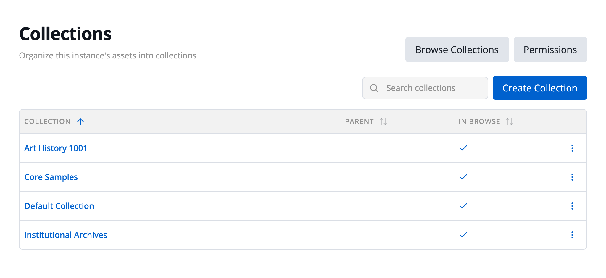
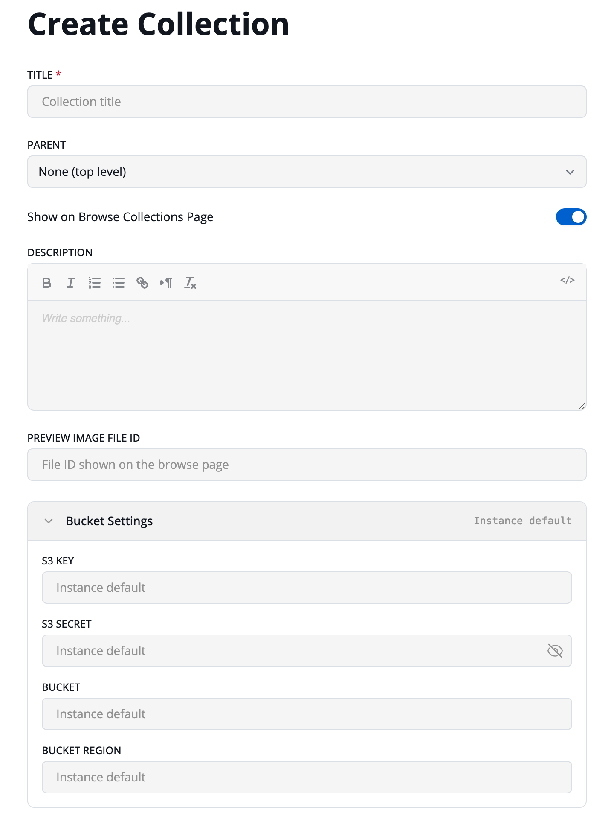

# Collections
Collections are groupings for assets.  You must have at least one collection in order to add assets.  

## Managing Collections

Open the main menu and choose **Admin** › **Edit Collections**. In a wide window, you can also choose **Collections** in the sidebar on admin pages. Administrators also see a **Manage Collections** button on the All Collections browse page.

The **Collections** page lists every collection in the instance, its parent, and whether it appears on the Browse Collections page (**In Browse**). Each row's **⋮** menu has **Edit**, **Permissions**, and **Delete**. See [Permissions](/permissions) for collection permissions.

## Creating a Collection
To create a collection, click **Create Collection**, fill in the form, and click **Create**. When editing an existing collection, the button is **Save**.

Generally, you’ll only need to populate the **Title** for your collection.

Collections can be nested within other collections by choosing a **Parent**, or **None (top level)** for a top-level collection.  They will be grouped hierarchically in dropdowns and in the collection browsing interface.

**Show on Browse Collections Page** controls whether the collection is listed on the All Collections page and in its parent collection’s list of sub-collections.

You can attach a **Description** which will be displayed when browsing the collections on your instance.  You can also add a **Preview Image File ID**, the ID of an uploaded file within your site, whose image is shown on the browse page.  To find a file’s ID, open its asset, click the pencil icon (**Edit Asset**), and click the arrow on the file’s entry to show its details.  The ID is listed as **File ID**.

### Storage

If you’d like this collection stored in a separate location in the cloud, open **Bucket Settings** and fill in **S3 Key**, **S3 Secret**, **Bucket**, and **Bucket Region**.  When you create a collection, fields left empty are filled with your instance’s current settings (shown as "Instance default"). After that, the collection keeps its own copy: changing the instance’s settings later doesn’t change it, and clearing a field while editing leaves the stored value in place.

Sometimes you may wish to use a separate bucket for a given collection.  For example, you may have most of your collections to automatically migrate original files to “glacier” storage, which is much less expensive, but much slower to access.  You may then wish to keep one collection’s original assets always available.

<Badge type="info" text="Classic UI" /> To create a new bucket, open **Admin** › **Edit Collections** and edit the collection. Click **Show Bucket Options**, clear the **Bucket** and **S3 Key** fields, and click **Create new bucket**. Fill in the **Create an S3 Bucket** dialog, click **Create Bucket**, and then save the collection.

## Sharing Collections <Badge type="info" text="Classic UI" />
Collections may be shared between instances.  By sharing a collection, you’ll be granting the receiving instance’s admin full power over your collection.

Open **Admin** › **Edit Collections** and click **Share** next to the collection.
