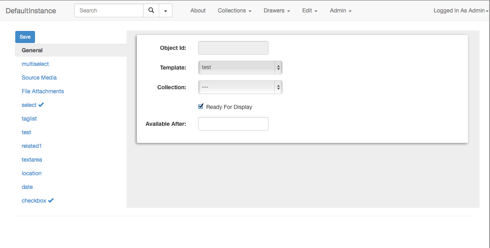
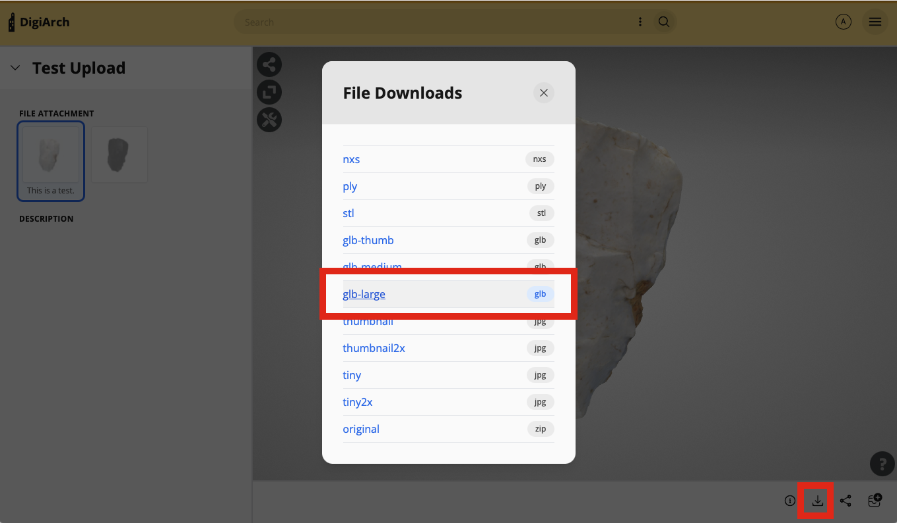

# Adding and Editing Assets

## Adding Assets

Once you’ve created at least one template, you can begin adding assets.

Select “Add Asset” from the “Edit” menu.  You’ll be presented with a popup that allows you to select the type of template you’ll be using.  You’ll then be presented with the “add asset” view for that specific template.

### General

All assets contain a “general” tab which contains a handful of settings about the asset.  

#### Collection

The collection not only defines how the asset will be grouped, but also defines where it will be stored in the cloud.  This must be set before you can upload assets.

#### Available After / Ready For Display

If “ready for display” is not checked, or “available after” is set to a date in the future, the asset will be hidden and not available within the search results.  Available after will automatically make the asset available in the future.

### Populating Fields

All of the fields from your template will appear along the left side of the window.  Click on each to see the individual field.  As you populate fields, a checkmark will appear next to it in the sidebar.

If a field allows multiple entries, click the plus sign to add additional fields.

### Saving

You may save at any time by clicking the “save” button.  If you have unsaved changes on the page, the save button will turn yellow.

### Uploading Files

You may select multiple files at the same time when uploading assets.  After starting a file uploading, you may move on to other tabs in the sidebar – the file upload will continue.  You will be prompted before leaving the page if the upload is incomplete.

If an upload fails for some reason, simply refresh the asset and select the file again.  It will resume where you left off.

After a file is uploaded, a small preview will be displayed.  You may add an additional description about the file if you’d like.

## 3D Models

Elevator supports two different 3D viewers, the [3DHop](https://3dhop.net) viewer from the [Visual Computing Lab](http://vcg.isti.cnr.it) at CNR-ISTI, as well as [Voyager](https://smithsonian.github.io/dpo-voyager/) from the Smithsonian. 3DHop is the default, but Voyager can be enabled on an instance-by-instance basis in the Instance Settings. 

The default mode for Voyager is a 3D model viewer with some basic tools for sliding and measurement. However, Voyager supports much more sophisticated annotation and tour-building. Currently, using these steps with Elevator requires a few extra steps. Eventually we hope to streamline these.

### Model Prep

Begin by uploading your model into an Elevator asset. In general, models should be zip files container OBJ, MTL and texture files. 

Once Elevator processes your model (this can take a few minutes) you should be able to see a basic 3D view on the asset page.

Now, use the "download derivatives" button and download the GLB-Large file.

### Tour/Annotation Creation

In your browser, load the [Voyager Story Standalone](https://3d.si.edu/voyager-story-standalone) application. This is the tool for building tours. Drag and drop your GLB file into the Story tool. When it prompts you for a derivative quality, select "High".

Now, add any tours, annotations, or other features to your model. Currently, the "articles" feature isn't supported, but we're looking at options for that going forward. 

When you've completed your work, click the download button in the upper right to download the finished scene. That will download a zip file.

### Adding the Scene to Elevator

Go back into the Edit view for your asset. Unzip the file that was downloaded by Voyager Story. Find the "scene.svx.json" file and open it in a text editor like VSCode, TextEdit or Notepad. 

Copy and paste all of the contents from this file into the "SVX" sidecar box in Elevator. Save your asset. Now reload the asset view - your story should appear.