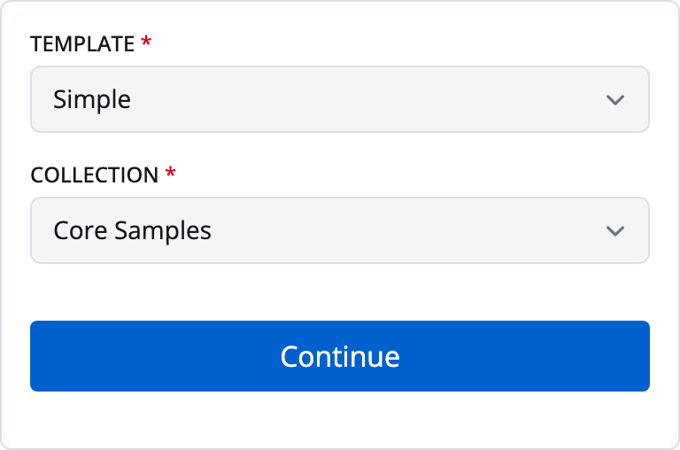
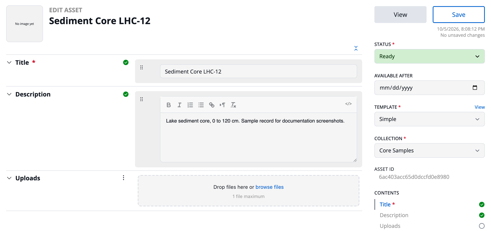

# Adding and Editing Assets

## Adding Assets

Once you’ve created at least one template, you can begin adding assets.

Open the main menu and choose **Manage Assets** › **Add Asset**.  Choose the **Template** you’ll be using and the **Collection** the asset belongs to, then click **Continue**.  You’ll then be presented with the asset editor for that template.

To edit an existing asset, open it and click the pencil icon (**Edit Asset**).

### Asset Settings

The right-hand sidebar holds a handful of settings about the asset, along with its **Asset ID** once it has been saved.

#### Collection

The collection not only defines how the asset will be grouped, but also defines where it will be stored in the cloud.  You choose it before the editor opens.  Changing it later in the sidebar asks you to confirm, then saves the asset and moves it to the new collection.  The asset is unavailable while it moves.

#### Template

The **Template** menu changes which template the asset uses.  Elevator first warns that switching templates may lose data and lists the fields that will be dropped, then saves the asset.  If you can edit templates, the **View** link next to the menu opens the template in the template editor.

#### Status / Available After

If **Status** is **Not Ready**, or **Available After** is set to a date in the future, the asset will be hidden and not available within the search results.  **Available After** will automatically make the asset available in the future.  New assets start as **Ready**.

### Populating Fields

All of the fields from your template appear in the main column, each in its own section that you can expand or collapse.  The button above the fields (**Expand All** or **Collapse All**) opens or closes every section at once.

The **Contents** list in the sidebar shows every field.  Click a field's name to jump to it.  A check mark appears next to each field you've filled in, and a warning icon marks a required field that's still empty.

If a field allows multiple entries, click the button below the field, labeled with the field's name and a plus sign, to add another entry.

### Saving

Click **Save** at the top of the sidebar to save.  When you have unsaved changes, **Save** changes from an outlined button to a filled one.  The text below it says "No unsaved changes" once everything is saved, and lists any **Missing required** or **Invalid** fields.  An asset marked **Ready** can't be saved while fields are listed there.  An asset marked **Not Ready** can be saved at any time.

### Uploading Files

To attach files, drag them onto an **Upload** field, or click **browse files**.  If the field accepts only one file, it says "1 file maximum", and the drop area disappears once a file is attached.  To accept more than one, turn on **Allow multiple** for that field in the template.  See [Field Options](/templates#field-options).

After starting a file upload, you may keep working on other fields, and the upload will continue.  You will be prompted before leaving the page if the upload is incomplete or you have unsaved changes.

If an upload fails for some reason, save your other changes, refresh the asset, and select the file again.

After a file is uploaded, a small preview will be displayed.  You may add **Alt Text** for the file if you’d like.  If **Show Description below Thumbnails** is turned on in **Instance Settings**, the field is labeled **Description / Alt Text** and the text also appears below the file's thumbnail.
