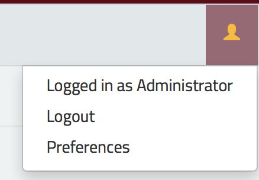
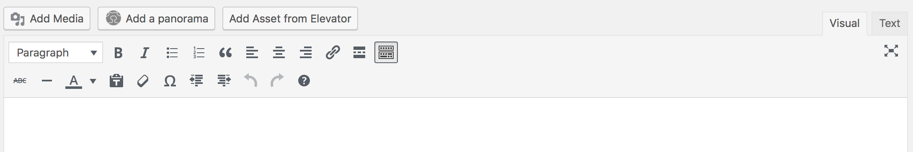
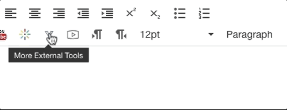
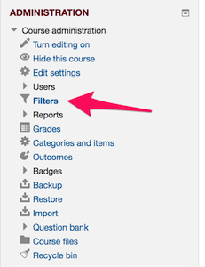
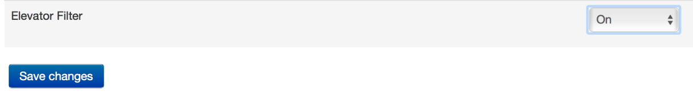
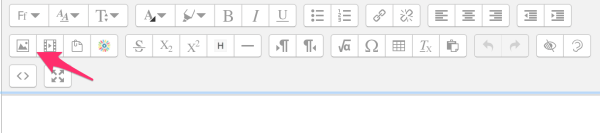

# Embedding Elevator Assets

## Wordpress

The Elevator WordPress plugin allows you to easily embed assets from Elevator within your WordPress posts and pages.

### Installing and Configuring the Plugin

To install the plugin, simply search the WordPress plugin library for “Elevator” and add it. You’ll need admin permissions.

After installing it, visit the settings page for the Elevator Asset Browser (within your WordPress “settings” section).  You’ll need to configure a bit of information.  First, enter the full URL for the Elevator site you’d like to use. You’ll also need a couple special bits of information – your Elevator key and secret.  You can find these by visiting your preferences page within Elevator.

Copy the key and secret values from Elevator (you’ll need to click the “eye” icon to reveal the secret) and paste them into the same fields in WordPress.

The plugin has a couple other settings, relating to the defaults for embedded assets.  The “include summary text” box controls whether the plugin adds some basic metadata about your assets when embedding them within WordPress.  If this box isn’t checked, the asset will be embedded without any additional data.

The “link to original asset” field controls whether the embedded asset contains a link back to your Elevator instance.

### Using the Plugin

The plugin can be used on any post or page within Elevator.  Once it’s installed, you’ll see a new “Add Asset from Elevator” box in your editor.  Clicking that will launch your Elevator site in a new window.  Simply browse your instance to find the asset you’d like to embed, and then click the “Add to WordPress” button in the toolbar.  That’ll automatically create the appropriate embed within your WordPress post.

### Advanced Usage

The Elevator plugin uses a special WordPress “shortcode” to handle the embed.  After embedding an asset, you can manually adjust values like height, width, or the embed options by changing the shortcode.  Click the preview button at any time to see how it’s working.

## Canvas

### Setup

Elevator will need to be enabled within your Canvas course site before you can begin using it.  Within your course site, select “settings” and then “apps”. Elevator should be displayed as an option.  Click on the icon and then select “add.” In the field that says “What is the name (URL) of the instance you’d like to use?”, enter the full address (without the http://) of your Elevator instance. For example, to use the DCL, enter dcl.elevator.umn.edu.

Now click the “Add App” button.  You’re all set!  If you use multiple Elevator sites, you can add each of them.

### Using Elevator to Embed Assets

Once you’ve setup the Elevator LTI, there’ll be a new Elevator button available in every text field in Canvas (**in some cases, it may take a minute or two for it to appear**).  To find it, click the “V” icon (“More External Tools”) which will reveal your Elevator button.  You can use it to add assets to pages, assignments, or anything else. Just click the button and an Elevator window will open.  Browse your site to find the asset you’d like to embed, and then click “Add to Canvas” in the Elevator toolbar. When you save your page in Canvas, the asset will be automatically embedded with the correct permissions, so all of your students will have access.

### Troubleshooting

* The instructor-facing part of the Elevator integration might be harder to use on very small screens or tablets.  If possible, use a traditional laptop or desktop computer.
* If you encounter any issues, try another web browser.  Please also let the service desk know, so we can try to implement any necessary fixes.
* When browsing for assets, Elevator should automatically log you in.  If you see “sign in” in the upper right corner, click that icon and then click “university login” to finish the login process.
* If you get errors about not being able to store cookies, visit api.elevator.umn.edu.  You don’t need to do anything – just visit that page once, and then try using canvas again.

## Moodle

When you’re working with Elevator within Moodle, there are a few important things to be aware of.

The first time you use Elevator within a given Moodle course, be sure to enable the Elevator filter.  Click on “Filters” in the “Administration” block and set the Elevator filter to “on.”  Then click “Save Changes”
 
 

The Moodle plugin will work with whichever your “Preferred Instance for Moodle” is, which you can set in your user preferences in Elevator, and which you can change at any time.

You’ll only need to do that once per course.  Then, you can access Elevator anywhere that Moodle gives you an “image picker” option in a text editing field.

Click the “insert image” button

Click “Browse Repositories”

Click “Elevator Search” and then click “Login to your account” if prompted

From there, you can browse the Collections and Drawers you’ve got access to, or do a search.  Just select the asset you want to insert.

You can resize and manipulate assets just like you would with an image.  Just keep in mind that things like videos won’t display while editing the content – click “Save and Display” to preview your page.

## Drupal

Christian Wood has [developed a plugin for Drupal](https://github.umn.edu/extension-technology/elevator_drupal) to allow easy embedding of content. The GitHub repo has all the of the necessary instructions.