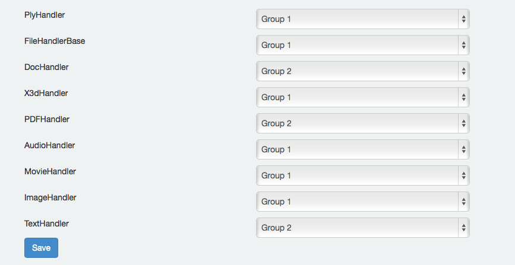

# File Handler Groups
Each Elevator instance may define how permissions are applied to the different types of file assets that can be uploaded.  For example, you may wish to apply one set of permissions to still images, and another to video files.  The “Edit File Handler Groups” button allows you to group the various file types into different groups.  These can then be used when applying permissions.

