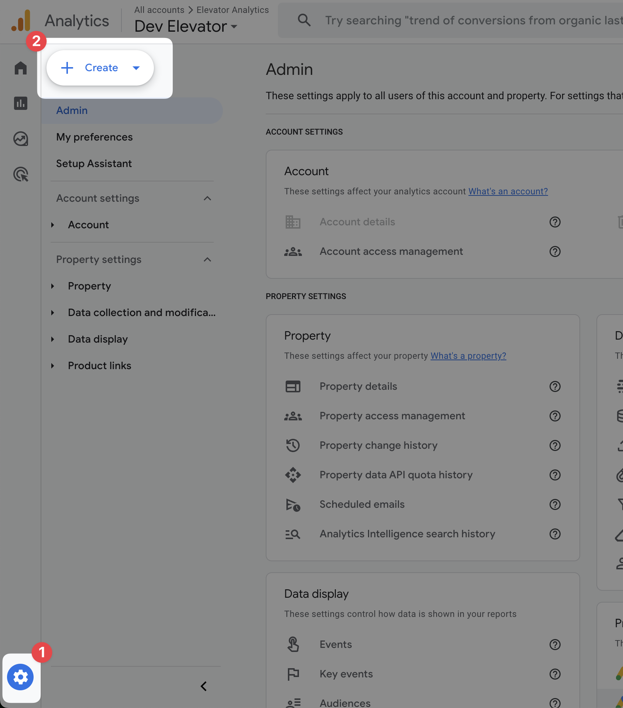
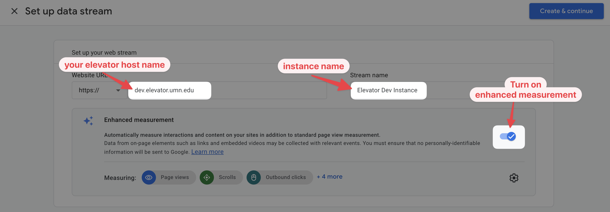
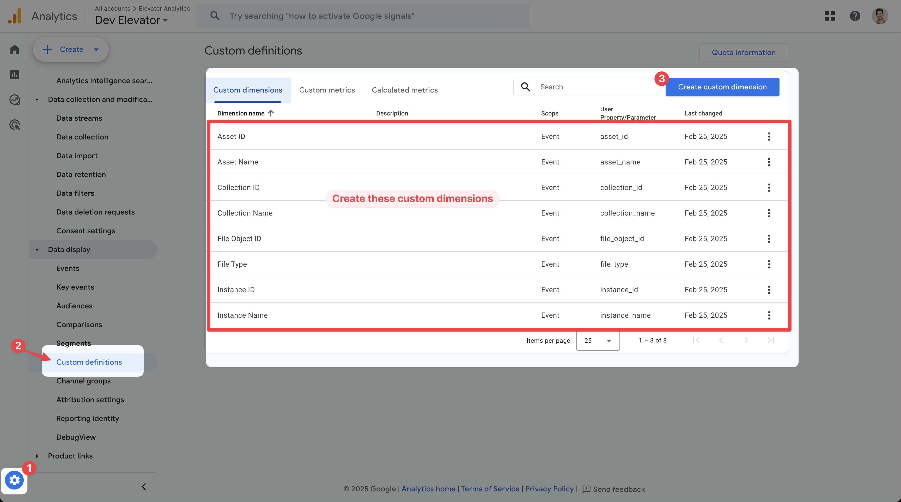
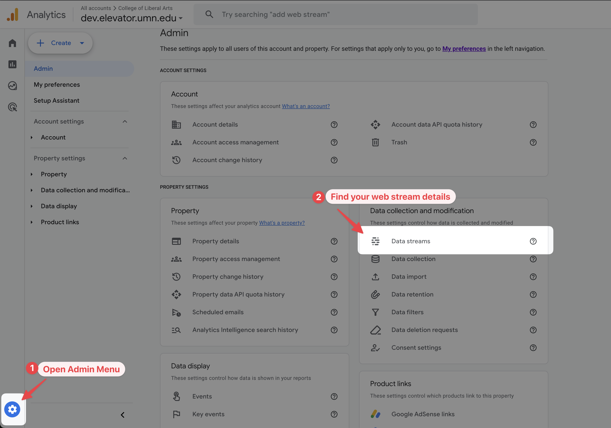
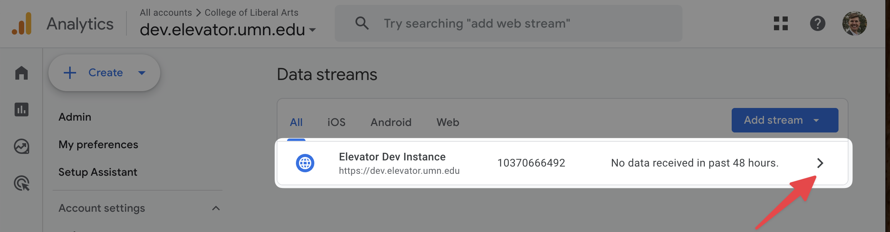
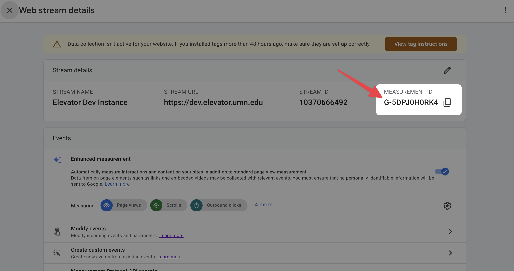
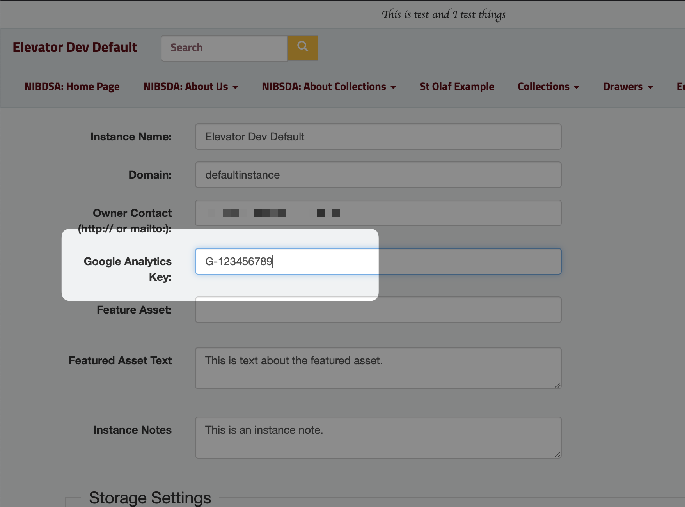
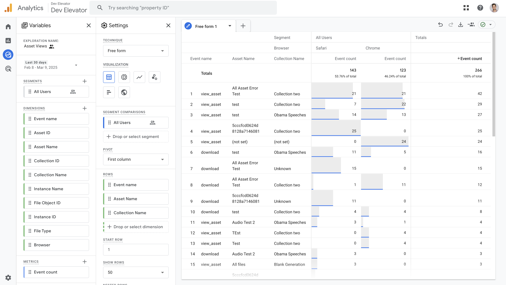

# Google Analytics

Admins can set up Google Analytics for greater visibility into what assets are viewed and downloaded.

## Create an Account

If this is your first time using Google Analytics at your institution, you may need to create a Google Analytics account. If you already have an account, skip this step.

1. Go to [analytics.google.com](https://analytics.google.com) and login.

2. In the `Admin` menu, choose `+ Create > Account`.

   

3. Under `Account Details`, enter your organization name, e.g. "UMN College of Liberal Arts".
4. Under `Account Data Sharing Settings`, choose if you wish to share any data, otherwise uncheck all the boxes.
5. Click `Next`.

## Create a Property

Within Google Analytics, each website you wish to track is called a "Property".

1. Under `Property Name`, enter your elevator instance name, e.g. "dcl.elevator.umn.edu".
2. Set your time zone, and click `Next`
3. Answer the questions under `Business Details`, and click `Next`
4. Set you `business objectives`, e.g. "understand usage"
5. Review and accept the `Terms of Service` if you wish.
6. Under `Start Collecting Data`, choose `Web`, then:

   - Enter your website url, e.g. `dcl.elevator.umn.edu`
   - Put your instance name as the `Stream name`, e.g. `UMN Digital Content Library`
   - Be sure `Enhanced Measurement` option is checked to gather page views and downloads.

   

7. Finally, click `Create & Continue` to generate your elevator instance.

## Set up Custom Dimensions in Analytics

In addition to default analytics info like page views, you can get Elevator-specific data about assets, collections, and file downloads if you set **Custom Dimensions** in Google Analaytics.

1. Go to `Admin > Data Display > Custom Definitions`

   

2. Under `Custom Dimensions` tab, create the following custom dimensions:

| Dimension Name  | Scope | Event Parameter   |
| --------------- | ----- | ----------------- |
| Instance ID     | Event | `instance_id`     |
| Instance Name   | Event | `instance_name`   |
| Asset ID        | Event | `asset_id`        |
| Asset Name      | Event | `asset_name`      |
| Collection ID   | Event | `collection_id`   |
| Collection Name | Event | `collection_name` |
| File Object ID  | Event | `file_object_id`  |
| File Type       | Event | `file_type`       |

## Set Measurement ID in Elevator

In **Google Analytics**, go to Web Stream details. (This may pop-up automatically after creating a new property.)

1. Go to `Admin > Data Streams`
   

2. Choose your the data stream for your elevator instance.
   

3. Copy your **Measurement ID**, something like `G-123456`.
   

Then, **in your elevator instance**:

1. Login to elevator. (You will need to be an admin.)
2. Choose `Admin > Instance Settings`
3. In the `Google Analytics Key` field, paste your Measurement ID
   

4. Save

## Verify data is flowing

Back in **Google Analytics**, you can verify that data is flowing from Elevator to analytics using [Google Tag Assistant](https://tagassistant.google.com). Tag assistant will open a debug view to show which events are sent.

1. Go to [tagassistant.google.com](https://tagassistant.google.com)
2. Choose `Add Domain`, and enter your elevator website URL, e.g. `https://dcl.elevator.umn.edu`.
3. Click `Connect` and tag assistant will open your elevator website in a new window or tab. This window/tab is in "Debug Mode", meaning any events from this browser window will show up in the Tag Assistant window.
4. Click around, or enter a search term in the Elevator window. In the tag assistant you should see the events.

> **NOTE:** Some browsers (e.g. Brave) will block transmitting analytics data by default. If you're testing your elevator site, be sure to disable this feature temporarily.

<video controls width="640">
   <source src="./analytics-using-tag-assistant.mp4" />
</video>

## Reporting

- Under `Reporting`, you should see activity in the `Realtime overview` and `Realtime pages` reports shortly after Google Analytics is set up.
- It will take 24 hours before you'll have enough data to create custom analytics reports.

Above is an example of a report using elevator data for asset and collections. To set up a report like this yourself, go to `Explore > Blank`, and then set:

**VARIABLES:**

- Date: Last 28 days
- Segments: `All Users`
- Dimensions:
  - Under `Event`: `Event Name`
  - Under `Custom`: `Collection Name`, `Asset Name`
- Metrics: `Event > Event Count`

**SETTINGS**

- Segment Comparisons: `All Users`
- Pivot: First Column
- Rows:
  - `Event Name`
  - `Collection Name`
  - `Asset Name`
- Values: `Event Count`

You can use `Filter` to limit results to specific events.
