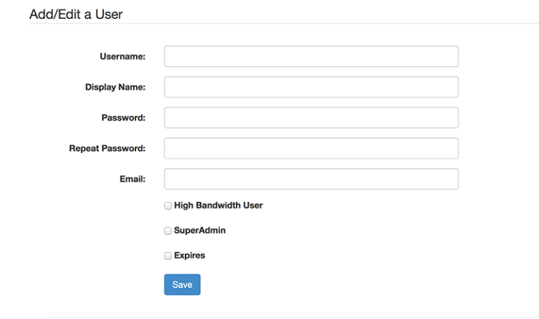
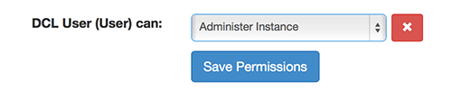

# Permissions
Elevator contains a robust permission system, which can be a bit overwhelming.

Permissions can be set on Instances, Collections, and Drawers.  Collection permissions can only be more permissive than instances – IE, an instance may be set to not allow downloads, but a specific collection can override that setting.

Setting permissions on drawers, instances and collections is done in the same way, via a similar interface.

Additional documents are below.  We also have two screencasts describing the most common permissions-related tasks.

## Creating new groups in Elevator
<iframe width="560" height="315" src="https://www.youtube.com/embed/pamex3tpQL8" frameborder="0" allow="accelerometer; autoplay; encrypted-media; gyroscope; picture-in-picture" allowfullscreen></iframe>

## Adding users to a group in Elevator
<iframe width="560" height="315" src="https://www.youtube.com/embed/t2PL9G2sof4" frameborder="0" allow="accelerometer; autoplay; encrypted-media; gyroscope; picture-in-picture" allowfullscreen></iframe>

## Types of Permissions
There are a variety of permissions that can be granted to users.

* No Permission – user/group will not be able to access anything, and will simply receive a “no permission” alert upon accessing the instance
* Search and browse – browse content, see thumbnails, but cannot download any higher quality versions
* View Derivatives (Group 1)- see “File Handler groups”
* View Derivatives (Groups 1 and 2) – see “File Handler Groups”
* Create/Edit drawers
* Download originals
* Add assets – user can create new assets on the site
* Administer instance – full control over the instance

In addition, users can be granted “superadmin” ability which allows them to create new instances.  This is done when adding users to the site

## Types of Groups
Permission can be granted to a variety of types of users.  These groups will vary with different Elevator installs.  Below is the list available at the University of Minnesota.

* All Users – anyone, without authentication
* Authenticated Users – anyone with an account
* Centrally Authenticated Users – university accounts
* Class Number – limited to a specific courseId
* Dept/Course number – supports wildcards, to capture multiple lecture sessions
* Job code – limited based on a job code
* Unit – A University of Minnesota department ID
* Specific People – a group of people, defined by their account name
* Student Status (Grad/Undergrad)
* Employee Type (Faculty/Student/Staff/etc)

Depending on your credentials, some of these may present “suggested values”.  For example, if you’re an instructor, Elevator will automatically suggest the courses you’re teaching.

## Adding Users
Elevator allows you to create local accounts for users.  From a permission editing screen, click “create local user” to begin.

Fill in the form to create an account.

As the creator of a local user, you may edit or remove that account at any time.

### SuperAdmin
Gives user permission to create new instances.

### Expires
Allows you to set an expiration date for this user.

## Granting Permission
To grant a user or group of users permission you begin by creating a group.  Click the “Create new group” button.

When adding individual users, the form will autocomplete based on central authentication and local users.  Click save to create the group.

Finally, select the permission you’d like to apply to this group from the drop down, and click save.

### Exceptions for Drawers 
Because drawers are created by users, permissions are slightly different.  Users may only grant other users or groups permissions to equal to, or less than, their own.  So, a user with “edit” permission can’t grant “admin” power.  

Granting “edit” ability on a drawer will allow that user to add additional content to that drawer.