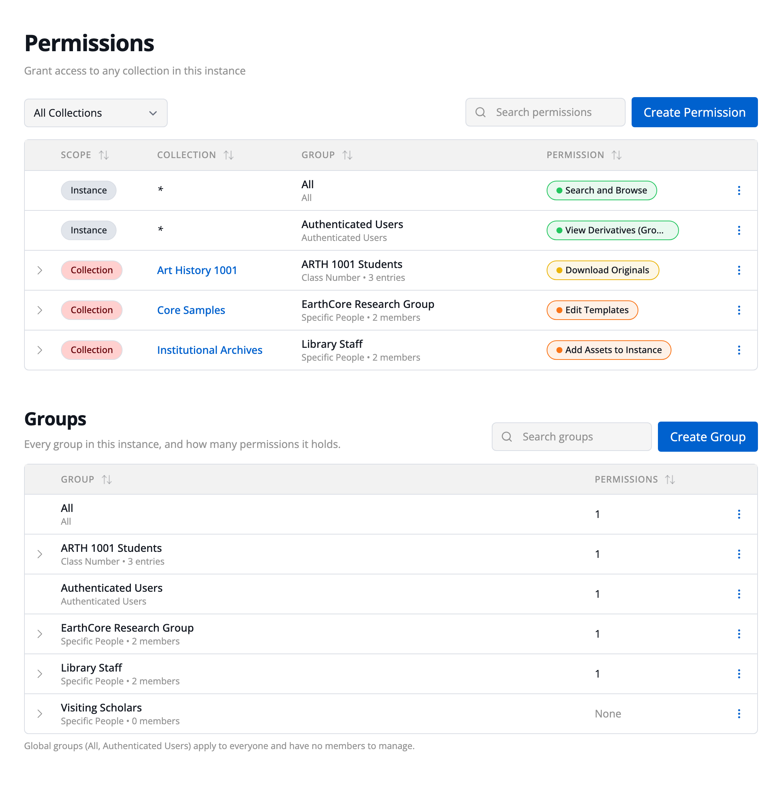
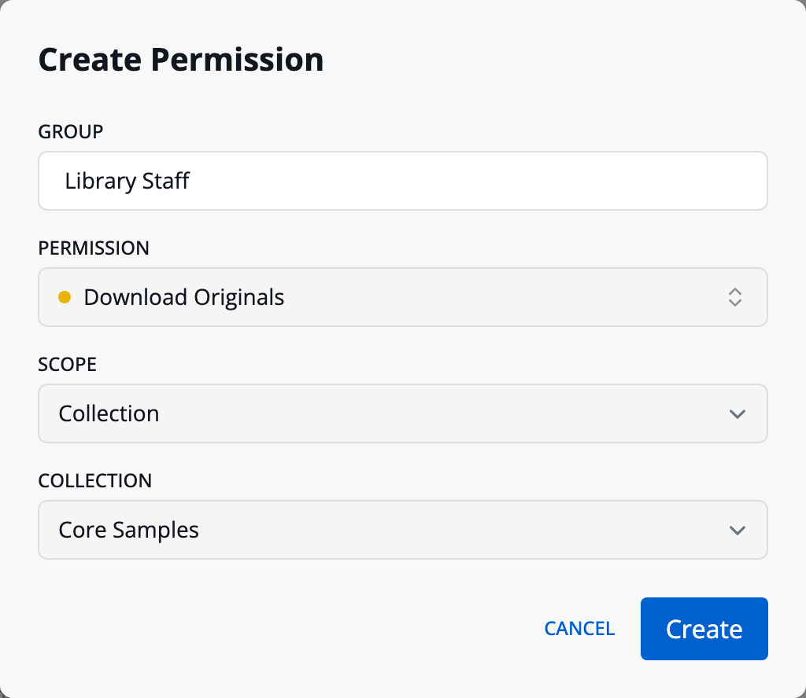
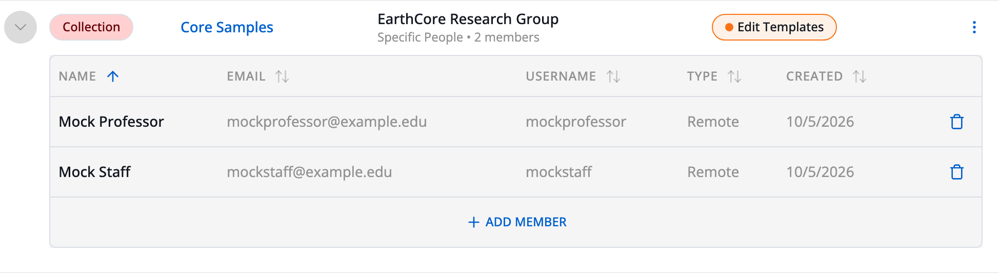
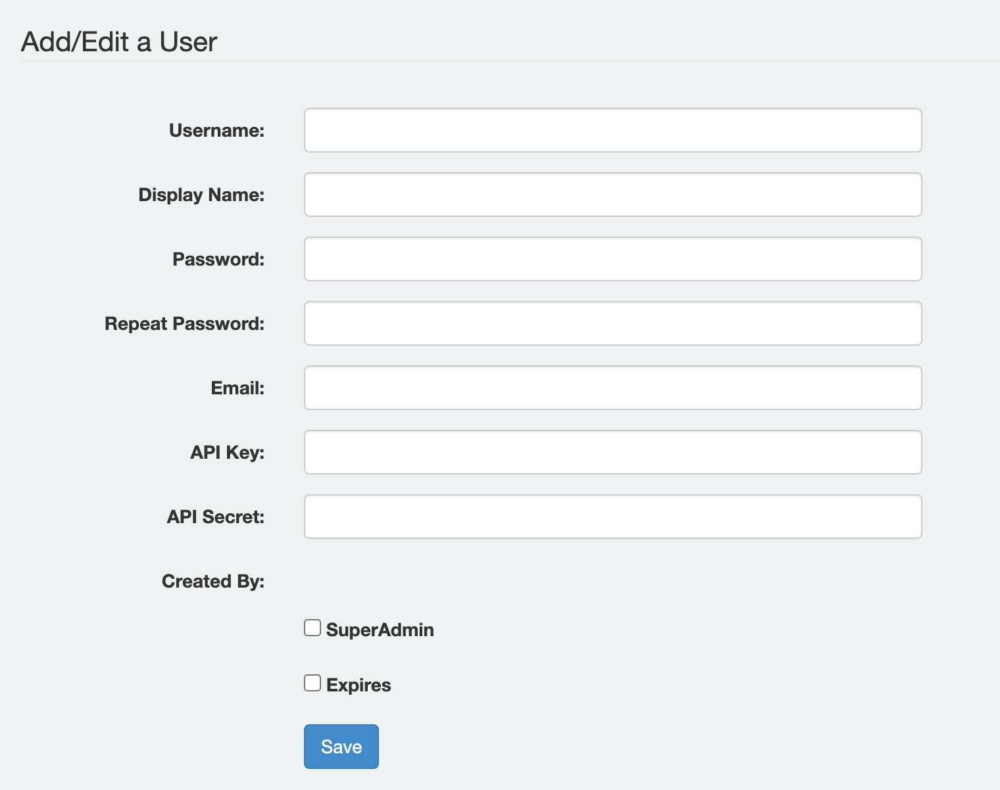

# Permissions

Permissions control who can see, search, and change assets and templates.

Every new instance starts locked down: only Elevator SuperAdmins have access until you grant permissions to others.

A permission has three parts:

- **A group**: the people it applies to, such as "Authenticated Users" or a list of specific people.
- **A level**: what those people can do, such as "Search and Browse" or "Add Assets to Instance".
- **A scope**: where it applies, either the whole instance (all collections) or a single collection.

Instance administrators manage instance and collection permissions on the **Permissions** page. Drawer owners share their drawers separately, from the drawer itself. See [Drawer Permissions](/using-drawers#drawer-permissions).

## Permission Levels

Each level includes everything the levels above it in this list allow.

| Rank | Level                           | What it allows                                                                                                                      |
| ---- | ------------------------------- | ----------------------------------------------------------------------------------------------------------------------------------- |
| 0    | No Permissions                  | Nothing. The user sees a "no permission" message when they visit the instance.                                                      |
| 1    | Search and Browse               | Search and browse assets and see thumbnails, but not larger versions of files.                                                      |
| 2    | View Derivatives (Group 1)      | View the display versions of files in File Handler Group 1. See [File Handler Groups](/file-groups).                                |
| 3    | View Derivatives (Groups 1 & 2) | View the display versions of files in File Handler Groups 1 and 2.                                                                  |
| 4    | Create/Edit Drawers             | Create drawers, add assets to them, and share them.                                                                                 |
| 5    | Download Originals              | Download the original uploaded files.                                                                                               |
| 6    | Add Assets to Instance          | Add new assets and edit existing ones.                                                                                              |
| 7    | Edit Templates                  | Create, edit, duplicate, reindex, and delete templates. This level does not include instance settings, permissions, or collections. |
| 8    | Administer Instance             | Full control of the instance, including settings, permissions, collections, and templates.                                          |

**Edit Templates** and **Administer Instance** only take effect when granted on the whole instance. Granted on a single collection, either one allows the same as **Add Assets to Instance** in that collection.

When someone belongs to more than one group, they get the **highest permission level** any of their groups grants.

::: info EXAMPLE
User is in 3 groups:

- _Authenticated Users_ with permission to **Search and Browse (Level 1)**
- _Grad Students_ with permission to **Download Originals (Level 5)**
- _Library Staff_ with permission to **Add Assets to Instance (Level 6)**

Their **effective permission** is the highest level: **Add Assets to Instance (Level 6)**
:::

## Instance and Collection Permissions

A permission's scope is either **Instance** or **Collection**.

- **Instance** permissions apply to every collection in the instance.
- **Collection** permissions apply to one collection and every collection nested inside it.

A collection permission can raise a group's access to the assets in that collection, but it can't lower it.

::: info EXAMPLE
User has these permissions:

- _Authenticated Users_ can **Search and Browse (Level 1)** on the **Instance** (all collections).
- _Research Group_ can **Add Assets to Instance (Level 6)** on the **Core Samples** collection.
- _Grad Students_ can **Create/Edit Drawers (Level 4)** on the **Core Samples** collection.

Their effective permission on Core Samples is **Add Assets to Instance (Level 6)**, which includes creating and editing drawers. In every other collection, they can only search and browse.
:::

## Groups

A group defines who a permission applies to.

Every instance offers these group types:

- **All**: everyone, including visitors who haven't signed in.
- **Authenticated Users**: anyone signed in, by any login method.
- **Centrally Authenticated Users**: anyone signed in through your institution's single sign-on.
- **Specific People**: people you choose by name, email, or username.

Your instance may offer more types, depending on how your institution connects to Elevator. At the University of Minnesota, these include Unit, Job Code, Class Number, Dept/Course Number, Student Status, and Employee Type. Elevator may suggest values based on your own account, such as the courses you teach.

## Managing Permissions

Open the **Admin** menu and choose **Instance Permissions**, or choose **Permissions** in the sidebar on any admin page. Only instance administrators can open this page.

The page has two tables:

- **Permissions** lists every permission in the instance: its scope, collection, group, and level.
- **Groups** lists every group in the instance and how many permissions it holds. A group with **None** holds no permissions yet.

To narrow the Permissions table, choose a collection from the **All Collections** menu, or type in **Search permissions**. Choosing a collection renames the page after it, such as "Core Samples Permissions". Click **Reset** to show every collection again.

You can also open one collection's permissions from the **Collections** page: choose **Permissions** from that collection's **⋮** menu.

### Granting a Permission

1. Click **Create Permission**.
2. In **Group**, start typing a group's name and choose it from the list. To make a new group, type its name, choose **Create group "…"**, and then choose its **Group Type**.
3. Choose a **Permission** level.
4. Choose a **Scope**: Instance or Collection. For a collection, choose it from the **Collection** menu. If you filtered the table to a collection, it's already chosen.
5. Click **Create**.

A group can hold only one permission level on the instance and one on each collection. If the group already has a level where you're granting one, Elevator warns you that saving will replace it.

When you create a new Specific People group, or a new group of one of your institution's types, Elevator opens it in the table so you can add its first members or entries.

### Creating a Group

To create a group before you decide its permissions, click **Create Group** above the Groups table. Choose a **Group Type**, enter a **Group Name**, and click **Create**. The new group holds no permissions. To give it one, choose **Add Permission** from its **⋮** menu.

### Adding People to a Group

Click the arrow at the start of a row, in either table, to expand its group.

- For a **Specific People** group, click **Add Member** and type a name, email, or username. If the person has never signed in to Elevator, choose **Provision and add remote user** to add them by username. To remove someone, click the trash icon on their row.
- For other group types, click **Add Entry** and choose a suggested value, or type your own and choose **Use "…"**. To change an entry, click its pencil icon. To remove one, click its trash icon.

**All**, **Authenticated Users**, and **Centrally Authenticated Users** include everyone who matches, so they have no members to manage.

### Changing or Removing a Permission

Each row in the **Permissions** table has a **⋮** menu:

- **Edit Group** changes the group's name, and the level of this permission.
- **Remove Permission** removes this one permission. The group and its members remain.
- **Delete Group** deletes the group and every permission it holds, on the instance and on every collection.

Each row in the **Groups** table has a **⋮** menu:

- **Edit Group** changes the group's name.
- **Add Permission** grants this group a permission.
- **Delete Group** works the same as in the Permissions table.

A group's type can't be changed after it's created. Removing a permission and deleting a group can't be undone.

## Creating a Local Account <Badge type="info" text="Classic UI" />

A local account signs in with a username and password stored in Elevator, rather than through your institution's login. Open **Admin** › **Instance Permissions (Classic)**, click **Create a local user**, and fill in the form.

You can edit any local account you created.

- **SuperAdmin** gives the account full control of every instance on this Elevator server, including creating new instances.
- **Expires** sets an expiration date for the account.
