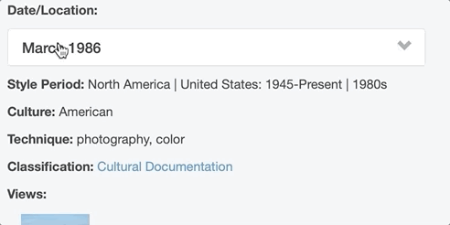
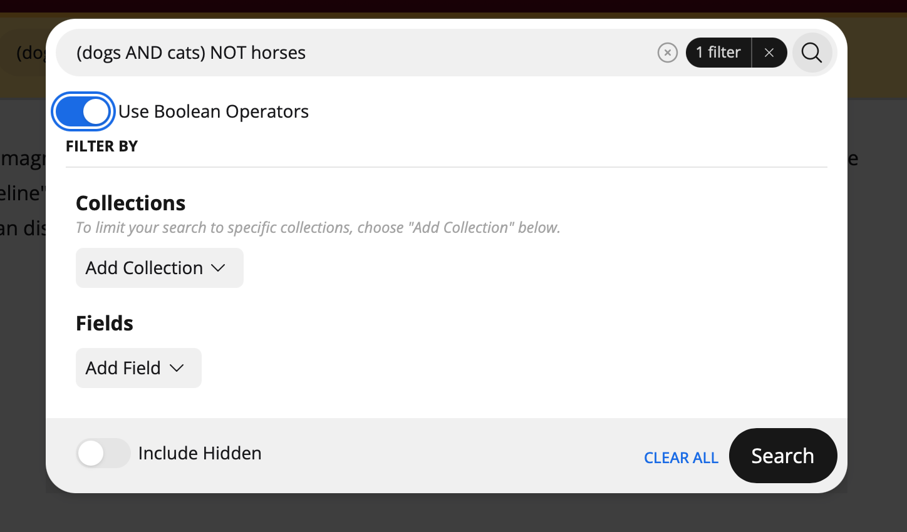
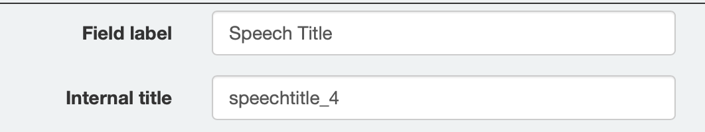
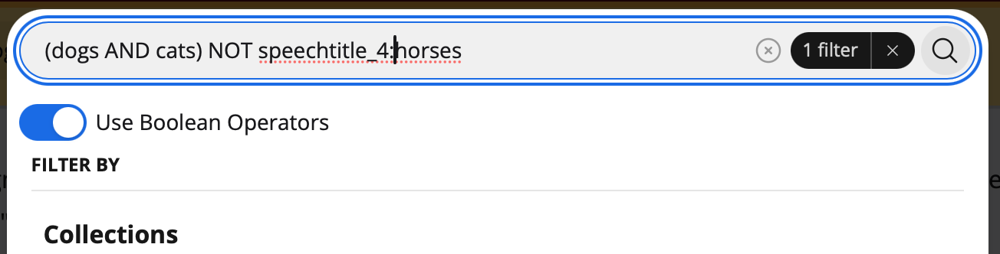

# Searching and Browsing

## Browsing Elevator

In most cases, Elevator sites will have a "collections" link at the top of the screen. If you click this, and then select "all collections" you'll see all of the collections within the Elevator site. Collections are like folders, that group content together. You can use these collections to explore the content within an Elevator site.

When you click on an individual asset within Elevator, you'll get to the "asset display" screen. "Previous" and "Next" buttons at the top of the screen allow you to easily move among assets. 

### Expanding Related Assets

Elevator can capture relationships between different assets, allowing you to explore an entire universe of content. These related assets are denoted by boxes with an arrow on the right side. 

### More Like This

At the bottom of items within Elevator, you'll see a box that says "more like this". When you click this, Elevator will look for items that it believes are related to the one you're looking at, based on the relationships it knows about.

## Searching Elevator

The primary means for discovering assets is via search. The search box will search across all of the indexed fields and attempt to return results based on relevance. Clicking the arrow to the right of the search box allows you to see recent searches, and to access the “Advanced” search options which allow for finer grained searching.

Elevator search can make suggestions for alternative spellings and uses “fuzzy” matching to find results.  We recommend starting with the main search box, rather than immediately using the advanced search.

By default, search results will be presented as a grid of preview images with brief descriptions. The tabs at the top allow you to toggle to other views.  The default list will be sorted based on relevance to your search, but you can use the sorting dropdown to select another sort order.

### Boolean Operators

The "Advanced Search" dialog provides the option of enabling boolean operators. For advanced users, boolean operators allow for very targeted and precise searches. 

Once you enable the "Use Boolean Operators" setting, you can construct a search which combines `AND`, `NOT`, `OR` and parenthesis. It's important that boolean operators are in CAPS, or they'll be treated as part of the search string. 

For even more targeted searching, you can explicitly specify template fields to search. Template field internal identifiers can be viewed when editing a template. Press control-command-h (Mac) or control-alt-h (Windows) to reveal the internal identifier. 

You can use that identifier as part of your boolean operation.

### Using the Timeline

If your assets contain “Date” fields, and those fields are indexed for searching, you will be able to view your assets on a timeline.

The timeline can be embedded in another website using the “embed timeline” link at the bottom of the page.

### Using the Map

If your assets contain “Location” fields, and those fields are indexed for searching, your results will be presented on a map.

The map can be embedded in another website using the “embed map” link at the bottom of the page.

