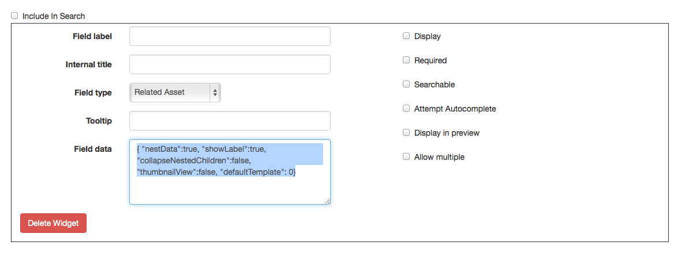

# Working with Templates

## Creating Templates
Templates that define which type of metadata you’d like to collect, and  are the key to adding assets to your Elevator instance.  You can create as many templates as you’d like, and you may nest templates within other templates.  

::: tip Gotcha
Even file attachments are a type of field within a metadata template.  If you don’t have an “upload” field, you won’t be able to attach files to your record.
:::

When adding an asset, template fields that are left empty won’t be displayed, so it’s ok to have “sometimes” fields in the template.

There’s no special “title” field in a template – whichever field you make the first field in a template will become a title.

### Creating a Template
Select “Edit Templates” from the Admin pulldown.  Click “Create New Template.”

Begin by giving your template a title that will make it clear what this template is for.

#### Include in Public search Results
Sometimes you want to add assets, but not have them included in public search results.  For example, if this template is intended to be nested within other templates (rather than existing on its own) you would leave this box unchecked.

#### Index For Searching
When unchecked, this template will not be indexed for searching at all.  Assets using this template can only be accessed via their unique identifier, or via links from other assets.  This is intended to be used for “join” templates – templates that join one asset to another asset with some descriptive data, but which have no value on their own.

#### Hide from “Add”
When checked, this template will not appear in the list of options when creating new assets, but still remains available for editing existing assets.  This is useful for templates you wish to deprecate, without removing their assets.

### Adding a Widget
Each field in your template is defined by a “widget”.  A widget has a variety of fields.

#### Field Label
The label that will be shown to viewers of this asset.

#### Field Type
See types of fields.

#### Tool Tip
Helpful text shown to users who are adding assets.  This can explain what should go in the field, or how it should be formatted.

#### Field Data
Custom JSON to define attributes about the field.  Only some fields contain this option.

#### Display
Controls whether the field is displayed when viewing an asset.  Some fields may be for internal use only.

#### Required
If this box is checked, the user will not be able to save an asset until this field is populated.

#### Searchable
Controls whether the field is indexed for searching.  If this field is likely to contain data of low relevance (numbers without context for example), exclude it from the search.

#### Attempt Autocomplete
If checked, the field will attempt to autocomplete as the user types, filling in results from other assets of the same template.

#### Display in Preview
Should this field be shown in the asset preview?  The asset preview is used on the search results page, in drawers, and in “related asset” views.

#### Allow Multiple
When enabled, users will be able to add multiple copies of this field.  For example, they may wish to add multiple dates to a single item.

#### Directly Searchable
This box controls whether this field will appear within the “Advanced search” box, as a field that can be searched exclusively.

#### Click to Search
When enabled, this will make the contents of the field into a link, which will trigger a new search.

### Saving a Template
After clicking “submit” you’ll be returned to the list of templates.  From here, you should adjust the display order for your newly created template.

## Other Template Controls

### Sort Order
The sort order for a template controls the order in which fields are shown to curators (those adding assets) and viewers (this viewing assets).  The first item in the “view” sort order will be the title for the asset.  Just drag and drop to rearrange.

### Duplicating Templates
You may wish to create a “Base” template, and then create an advanced version.  To do this, create the base template, then use the “duplicate” feature to clone the template, and add your “advanced” fields.

### Deleting Templates
Deleting templates will cause assets that use this template to be displayed incorrectly.  **Use with caution!**

### Reindex
Some of the changes you make a template may require Elevator to reindex all of the assets that use that template. Normally, that happens automatically via a background process. However, you can force that to happen by clicking the "reindex" link. For large sets of assets, it can still take a few minutes to fully reindex.
