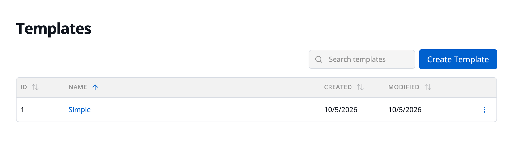
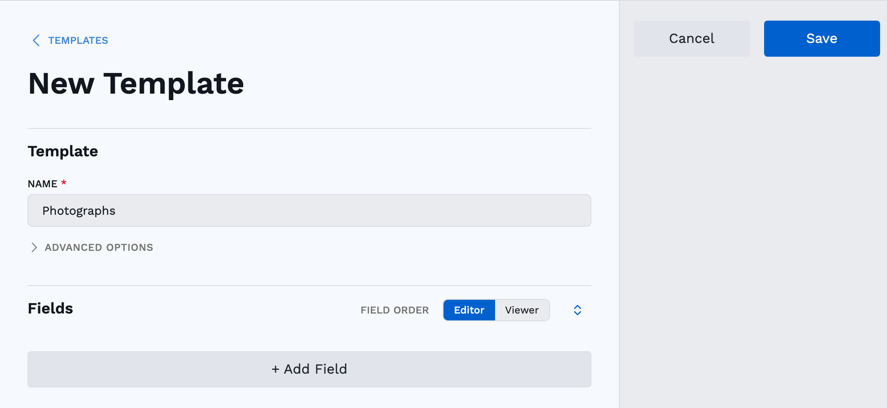
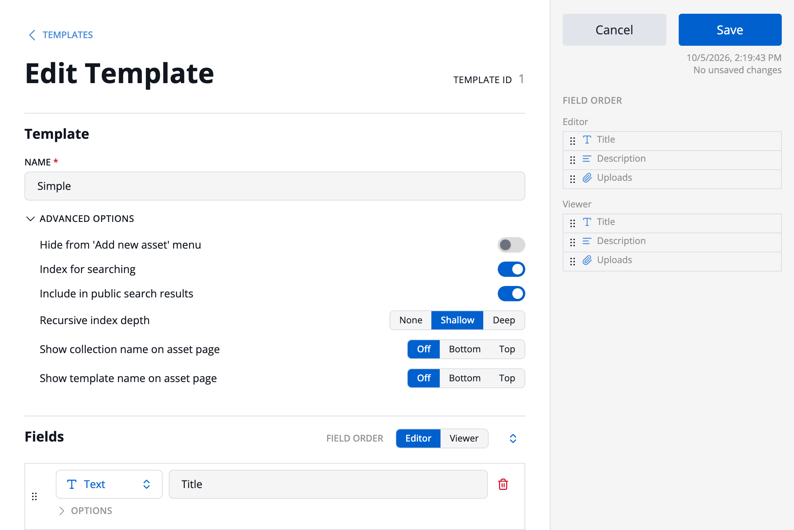
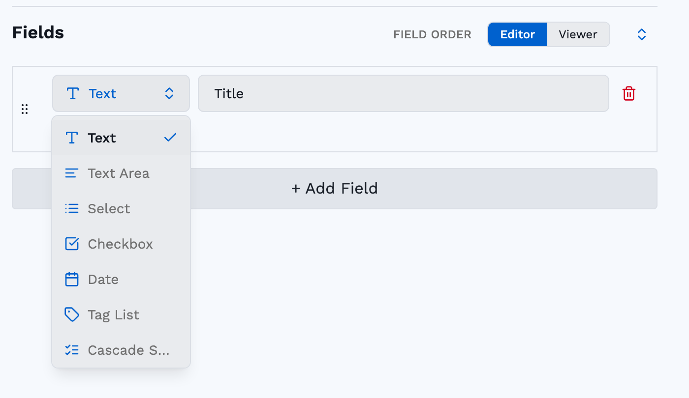
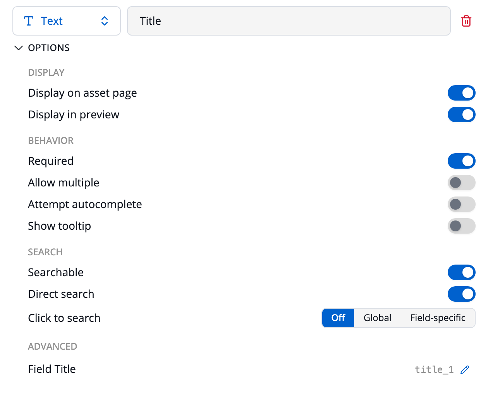
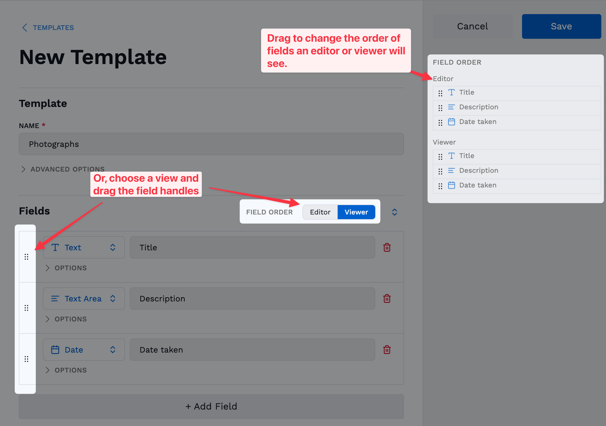
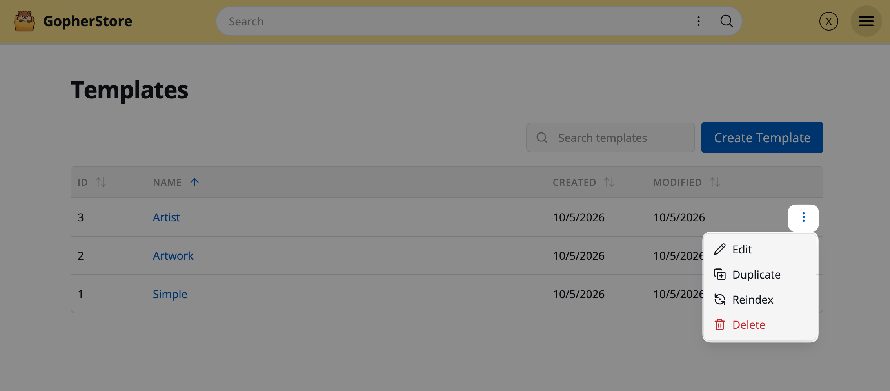

# Working with Templates

Templates define which metadata you collect for each asset, and they're the key to adding assets to your Elevator instance. You can create as many templates as you like, and you can nest templates within other templates.

<iframe src="https://www.youtube.com/embed/S54sySvBRRk" title="Creating Templates and Assets in Elevator" style="width: 100%; aspect-ratio: 16 / 9; border: 0" allow="accelerometer; autoplay; clipboard-write; encrypted-media; gyroscope; picture-in-picture" allowfullscreen></iframe>

## The Templates List

Open the **Admin** menu and choose **Edit Templates**, or choose **Templates** in the sidebar on any admin page. You need the **Edit Templates** or **Administer Instance** permission on the instance. See [Permission Levels](/permissions#permission-levels).

The list shows each template's ID, name, and when it was created and last modified. Type in **Search templates** to narrow the list. Click a template's name to edit it.

Each row's **⋮** menu has **Edit**, **Duplicate**, **Reindex**, and **Delete**. See [Duplicating, Reindexing, and Deleting](#duplicating-reindexing-and-deleting).

## Creating a Template

1. On the Templates list, click **Create Template**.
2. Enter a **Name** that makes clear what the template is for.
3. Optionally, set the [Advanced Options](#advanced-options).
4. Add fields with **+ Add Field**. See [Adding a Field](#adding-a-field).
5. Click **Save**.

The new template starts with an empty **Fields** section. Here, the template is named "Photographs" and is ready for its first field.

**Save** keeps you in the editor, so you can go on making changes. The sidebar shows when the template was last saved, and "No unsaved changes" once everything is saved. **Cancel** returns to the Templates list.

## Advanced Options

Click **Advanced options** below the template's name to show these settings. Elevator sets sensible defaults for them.

### Hide from 'Add new asset' menu

When on, this template doesn't appear in the list of templates when creating new assets, but it's still available for editing existing assets. This is useful for templates you want to retire without removing their assets.

### Index for searching

When off, this template isn't indexed for searching at all. Assets using this template can only be reached by their unique identifier, or by links from other assets. This is meant for "join" templates: templates that connect one asset to another with some descriptive data, but have no value on their own.

### Include in public search results

Sometimes you want to add assets but keep them out of public search results. For example, if this template is meant to be nested within other templates rather than stand on its own, turn this off.

### Recursive index depth

When a template uses a **Related Asset** field to point to other assets, Elevator's search engine also indexes those related values. Choose **None**, **Shallow**, or **Deep**.

For example, suppose a template lists classrooms, and each classroom points to a "building" asset through a Related Asset field. To make a search for a building's name return every classroom in it, choose **Shallow**. If each building also points to a "campus" asset, **Deep** lets a search for the campus return all of its classrooms.

### Show collection name on asset page

Adds the asset's collection to the asset page, so viewers can click it and browse every asset in that collection. Choose **Off**, **Bottom** (with the asset's other fields), or **Top** (as a breadcrumb).

### Show template name on asset page

Templates usually matter only to administrators and curators. If you want viewers to see and browse by template, this adds the asset's template to the asset page, so viewers can click it and browse every asset that uses it. Choose **Off**, **Bottom**, or **Top**, the same as for the collection name.

## Adding a Field

Each field in a template appears as a card in the **Fields** section. Click **+ Add Field** to add one, then set:

- **Field type**: what kind of data the field holds, such as Text, Date, or Upload. See [Types of Fields](/field-types).
- **Label**: the name viewers see for this field.
- **Field data (JSON)**: settings for the field, shown only for field types that use them. Elevator fills it with sample JSON when you choose the type. If the JSON isn't valid, the box shows **Invalid JSON** and **Save** stays disabled until you fix it.

The field type is the dropdown on the left of the card. For a title, choose **Text** and enter "Title" in the label box beside it. Click **+ Add Field** again for each additional field.

::: tip
There's no special "title" field. The first field in a template's **Viewer** order becomes the asset's title. See [Field Order](#field-order).
:::

To remove a field, click its trash icon and confirm. Any data already saved in that field will no longer be visible or editable.

::: tip
When adding an asset, template fields left empty aren't displayed, so it's fine to have "sometimes" fields in a template.
:::

::: tip
Even file attachments are a type of field within a template. Don't forget to add an **Upload** field to your template so that you can add files to assets.
:::

### Field Options

Click **Options** on a field's card to show its settings. The expand button next to **Field order** opens or closes the options on every card at once.

#### Display

- **Display on asset page**: whether viewers see this field on the asset page. Some fields may be for internal use only.
- **Display in preview**: whether this field appears in the asset preview, which is used in search results, in drawers, and in related asset views. After changing this, [reindex](#reindexing) the template.

#### Behavior

- **Required**: when on, an asset can't be saved until this field has a value.
- **Allow multiple**: when on, curators can add more than one value. For example, an item might need several dates.
- **Attempt autocomplete**: when on, the field suggests values as curators type, drawn from other assets that use the same template.
- **Show tooltip**: when on, enter **Tooltip text** to help curators adding assets. It can explain what belongs in the field, or how to format it.

#### Search

- **Searchable**: whether this field is indexed for searching. If a field is likely to hold data of low relevance, such as numbers without context, turn this off.
- **Direct search**: whether this field appears in **Advanced Search** as a field that can be searched on its own.
- **Click to search**: makes the field's value a link that starts a new search. **Global** searches every field for that value. **Field-specific** searches only this field.

#### Advanced

- **Field Title**: the field's internal name, which field-specific searches use. Elevator creates it from the label, such as `title_1`. To change it, click the pencil icon. It may contain only lowercase letters, numbers, underscores, and hyphens, and no two fields in a template can share one. Changing a field title can break saved data.

## Field Order

Each template has two field orders:

- **Editor**: the order curators see when adding or editing an asset.
- **Viewer**: the order viewers see on the asset page. The first field in this order is the asset's title.

To change an order, use either of these:

- Choose **Editor** or **Viewer** next to **Field order** above the field cards, then drag cards by their handles. Dragging changes the order you chose.
- Drag a field's name in the sidebar's **Editor** or **Viewer** list.

In this example, **Viewer** is selected above the cards. "Title" is first in the sidebar's **Viewer** list, so its value will become each asset's title. The template also has a **Text Area** field labeled "Description" and a **Date** field labeled "Date taken".

Then click **Save**. If you moved a field that appears in previews, [reindex](#reindexing) the template.

## Duplicating, Reindexing, and Deleting

These actions are in each template's **⋮** menu on the Templates list, and each asks you to confirm.

### Duplicating

You may want a "base" template and a more detailed version of it. Create the base template, choose **Duplicate** to copy it, and then add the extra fields to the copy.

### Reindexing

Some template changes require Elevator to reindex every asset that uses the template. The template editor doesn't start a reindex when you save, so choose **Reindex** after any of these changes:

- Turning **Display in preview** on or off for a field.
- Changing the **Field Title** of a field that appears in previews.
- Moving a field that appears in previews.

Reindexing also covers any related templates. For large sets of assets, it can take a few minutes to finish.

### Deleting

Deleting a template causes assets that use it to display incorrectly, and it can't be undone. **Use with caution!**
