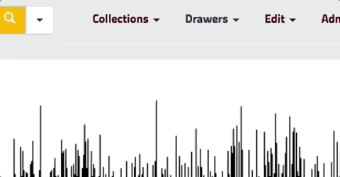
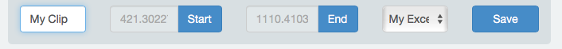

# Working with Drawers

Drawers are user-defined groups of assets. Given appropriate permissions, users of your instance can create drawers, add assets to those drawers, and share them with other users. Drawers can also store video excerpts - clips of longer videos which can be linked to directly. 

## Creating Drawers

To create a drawer, begin by browsing to an asset you’d like to store in a drawer.  Then select “Drawers” and “Add to Drawer”

Enter the name for the drawer in the “Add a Drawer” field and click “Create Drawer”.  You can then select that drawer from the dropdown and click “Add to Drawer” to add the selected asset to your drawer.

## Adding Assets to a Drawer

You can add assets to a drawer from either the search results page or an individual asset.  Select the “Drawer” menu and then “Add to Drawer” and select the drawer to which you’d like to add the asset(s).  Click “Add to Drawer” to confirm.

## Drawer Permissions

Drawer permissions can be kind of complicated.  Feel free to reach out to us directly for help.

Drawers follow the same permissions setup as the rest of Elevator, with the exception that Drawers don’t have a concept of “administration”.

Begin by browsing to your drawer.  Select “Drawers” and then “All Drawers” and click on the drawer you’d like to edit.  Then select the drawer dropdown again and select the Drawer Permissions option.

Click the Create a new group button partway down the page. Select a Group Type from the dropdown list. To add a course, select Course. Your current courses are listed in the dropdown; select the course you want to assign to this Drawer, and then click the Save button. See the screencast below for a walkthrough.

<iframe width="100%" height="480" src="https://www.youtube.com/embed/sJqRTntThMY" frameborder="0" allow="accelerometer; autoplay; clipboard-write; encrypted-media; gyroscope; picture-in-picture" allowfullscreen></iframe>

## Video Excerpts

Elevator has the ability to save snippets of video (called excerpts) within drawers.  In order to use this feature, you must have at least one drawer.

When viewing a video, click the small “clock” icon to reveal the excerpt controls.  Begin by setting a title for your excerpt.  Then select your drawer from the dropdown.  Now, play your video and use the seek bar to move to the start of your clip.  Click the “start” button to mark this point.  When your video reaches the end of your clip, click the “end” button.  Finally, click “Save”.

