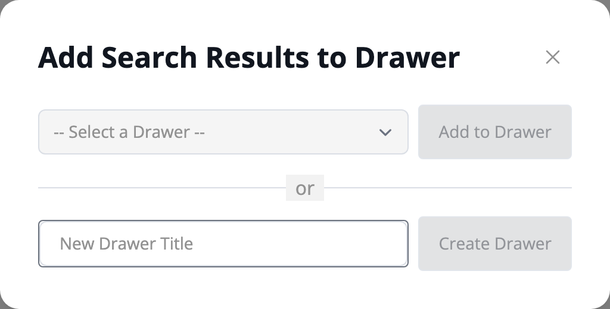
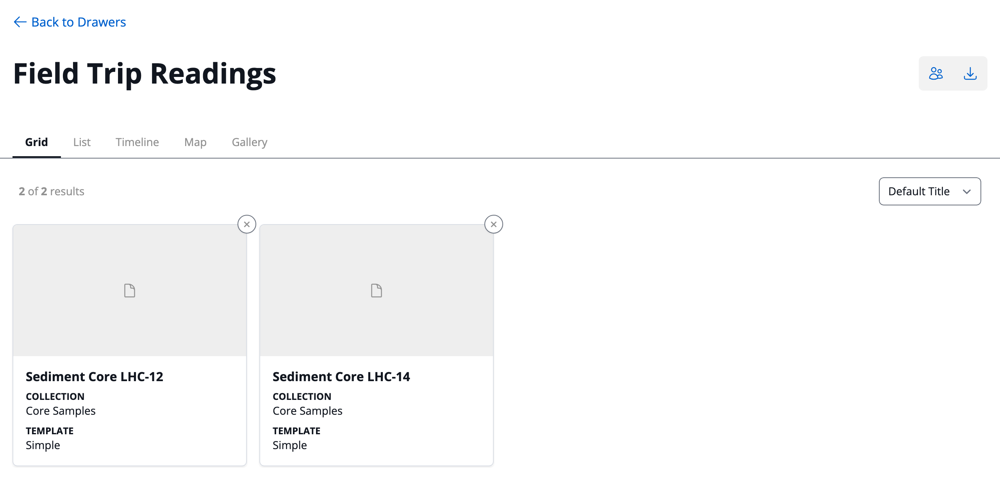
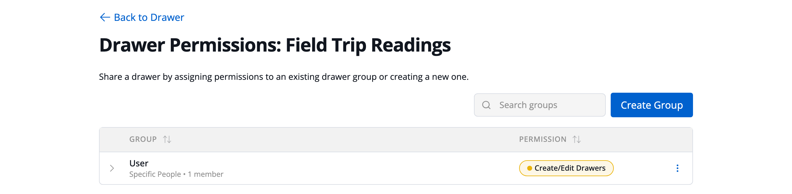
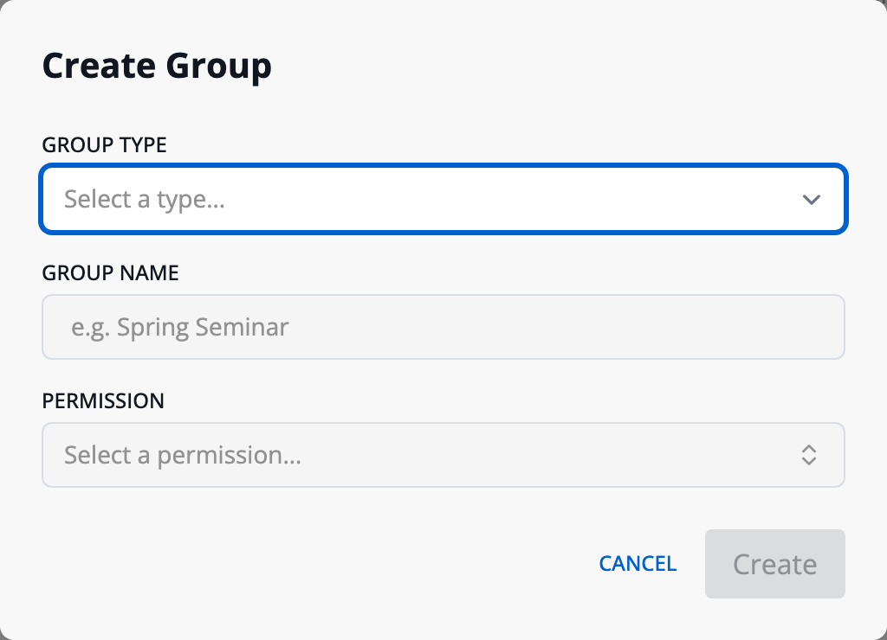

# Working with Drawers

Drawers are user-defined groups of assets. Given appropriate permissions, users of your instance can create drawers, add assets to those drawers, and share them with other users. Drawers can also store video excerpts - clips of longer videos which can be linked to directly. 

## Creating Drawers

To see your drawers, open the main menu and choose **Drawers**. To create an empty drawer there, click **Create Drawer**, enter a **Drawer Title**, and click **Create**.

You can also create a drawer at the moment you add assets to it. See [Adding Assets to a Drawer](#adding-assets-to-a-drawer).

## Adding Assets to a Drawer

You can add assets to a drawer from either an individual asset or the search results page.

- **From an asset:** click the drawer icon (**Add to Drawer**) in the toolbar below the file viewer. Choose an **Existing Drawer**, or type a name in **New Drawer** to create one, and click **Add to Drawer**.
- **From search results:** click the drawer icon (**Add Search Results to Drawer**) at the right end of the results bar. This adds only the results loaded so far, the first number in a count such as "30 of 120 results". To add them all, click **Load All** (or **Load More**) next to the count first. Choose a drawer and click **Add to Drawer**, or type a new drawer title and click **Create Drawer** to create a drawer and add the results to it.

## Viewing a Drawer

Open a drawer from the **Drawers** page to see its assets. The drawer has the same **Grid**, **List**, **Timeline**, **Map**, and **Gallery** views as search results. To remove an asset from the drawer, switch to **Grid** view, click the × on its card, and then click **Remove**.

The icons at the upper right open the drawer's permissions (**Edit Permissions**) and download the drawer (**Download Drawer**).

## Drawer Permissions

Drawer permissions can be kind of complicated.  Feel free to reach out to us directly for help.

Drawers follow the same permissions setup as the rest of Elevator, with the exception that Drawers don’t have a concept of “administration”.

Begin by opening your drawer from the **Drawers** page. Then click the people icon (**Edit Permissions**) at the upper right. The **Drawer Permissions** page lists the groups that can use the drawer and the permission each one has, along with any other groups you own. A new drawer starts with one group: you, with **Create/Edit Drawers**. To give one of your existing groups access, choose **Edit Group** from its **⋮** menu and pick a permission.

To share the drawer with more people, click **Create Group**. Choose a **Group Type**, enter a **Group Name**, choose a **Permission**, and click **Create**. The new group's row then opens with a form to add people (**Add Member**) or values such as a course (**Add Entry**). Types marked "(admin only)" can only be chosen by instance administrators. The types available depend on how your institution connects to Elevator. At the University of Minnesota, choose **Class Number** or **Dept/Course Number** to share a drawer with a course. **Dept/Course Number** accepts `%` as a wildcard, such as `DEPT.NUMBER%` to include every section. See [Groups](/permissions#groups) for what each type means.

See the screencast below for a walkthrough.

<iframe width="100%" height="480" src="https://www.youtube.com/embed/sJqRTntThMY" frameborder="0" allow="accelerometer; autoplay; clipboard-write; encrypted-media; gyroscope; picture-in-picture" allowfullscreen></iframe>

## Video Excerpts

Elevator has the ability to save snippets of video (called excerpts) within drawers.

When viewing a video or audio file, click the drawer icon (**Add to Drawer**) in the toolbar below the player, and choose a drawer as above. Select **Add as Excerpt**, and give the excerpt an **Excerpt Name**. A player appears in the dialog. Play the file there, and when it reaches the start of your clip, click **Set** next to **Start Time**. When it reaches the end, click **Set** next to **End Time**. You can also type the times, as minutes and seconds (MM:SS) or hours, minutes, and seconds (HH:MM:SS). Finally, click **Add to Drawer**.
