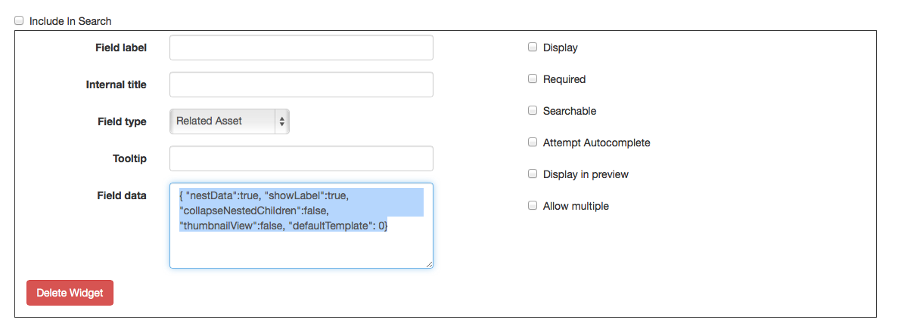
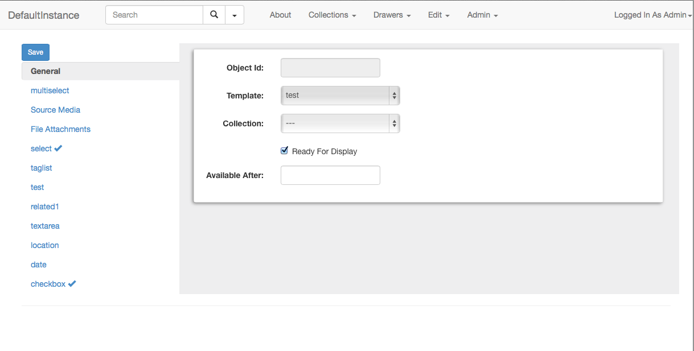
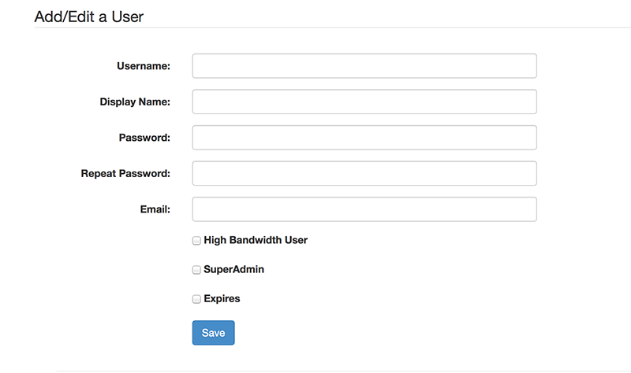
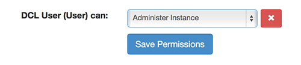
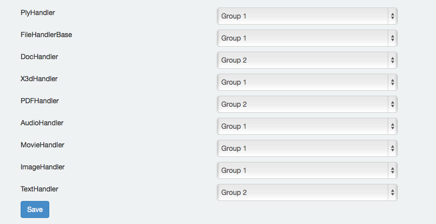
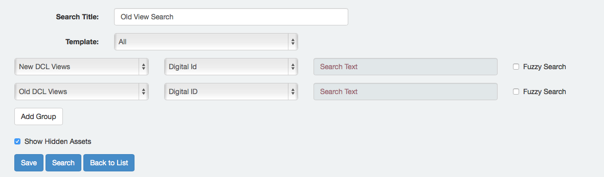
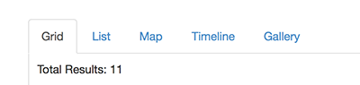

# Elevator Documentation #

# Overview #

Elevator is a web application for cataloging, searching, and distributing digital assets and metadata.  It is designed to be flexible and scaleable, from individual users to whole campuses.

Elevator doesn't impose any fixed schema or design - you can customize it for the type of data you've got.

## Important Terms and Topics ##

Elevator has a few key terms to describe the types of operations you'll be performing.  It's important to distinguish between these, or things can get pretty confusing.

### Instance ###

An instance can be thought of as a "site" or a catalog.  Instances are completely separate silos - data from one instance isn't visible to other instances.  Instances can be customized for particular groups, and are responsible for their own costs (Amazon storage fees).


### Assets ###

An asset is an individual object within your instance.  At minimum, an asset contains some metadata or descriptive information.  Additionally, assets usually contain at least one digital object (a file - image, video, etc).

### Templates ###

A template defines the fields that will be available when adding an asset.  Fields may be text entry, location fields, dates, etc.  An instances can contain many templates, and you can mix and match assets based on different templates.

### Collections ###

Collections are groupings of assets.  Assets can only existing within one collection at a time.  Collections make it easy to browse assets based on topics or logical groupings.  Collections can be nested (collections can be organized inside other collections).

### Drawers ###

Drawers are user-defined groups of assets.  Given appropriate permissions, users of your instance can create drawers, add assets to those drawers, and share them with other users.

## Administrative Support ##

Elevator is still being developed.  If you encounter issues, note the time and date.  High level administrators can also visit the "logs" section under the admin drop down.

# Defining Templates #

Templates that define which type of metadata you'd like to collect, and  are the key to adding assets to your Elevator instance.  You can create as many templates as you'd like, and you may nest templates within other templates.  

**** Gotcha: Even file attachments are a type of field within a metadata template.  If you don't have an "upload" field, you won't be able to attach files to your record.****


## Behaviors of Templates ##

When adding an asset, template fields that are left empty won't be displayed, so it's ok to have "sometimes" fields in the template.

There's no special "title" field in a template - whichever field you make the first field in a template will become a title.

## Types of Fields ##

### Text ###

A text field is a simple one-line text entry box.

### Text Area ###

A text area is a larger text entry field which supports line returns and formatting.

### Date ###

A date field can contain either a single date (4/1/2014) or a range of dates.  Date fields also support dates in the form of "10000 BCE".  

### Location ###

A location will be a latitude and longitude, along with a label.  You can look up a location by address, or by entering the coordinates.  If you don't enter a label, the latitude and longitude will be displayed to your viewers.

### Select ###

A select dropdrop.  The items in the drop down are defined in the template, using the JSON format.  A basic drop down is:


```{
  "selectGroup": 
    {
    "Option 1":"more text about option 1",
    "Option 2":"more text about option 2",
    "Option 3":"more text about option 3"
	}
}```
 

The "more text" is the text that will be displayed to the viewer of an asset.  The "option" entry is what will be displayed to the person adding the asset.
 
The "more text" section can be omitted.    Sample JSON is displayed when adding this field to a template.
  
### Multi-Select ###
 
 
A multiselect is a cascading select.  For example, you may first select a country, then a state, then a city.

These are complicated structures and it's recommended that you define the JSON for them using a JSON editor.  Sample JSON is displayed when selecting this field in the template.

### Tag List ###

A tag list is a comma separated set of tags. Each tag will automatically be linked to a search for that term.

### CheckBox ###

A simple on/off checkbox

### Related Assets ###

This field allows you to link or embed other assets within one asset.  For example, you may create a "person" template for defining content creators, and then nest those records within records describing their content.  This type of field can be customized using some additional JSON, as follows.

```{ "nestData":true, "showLabel":true, "collapseNestedChildren":false, "thumbnailView":false, "defaultTemplate": 0, "matchAgainst": 0, "displayInline": false}```


#### nestData ####

Should the nested asset be displayed inline, or should the user click a link and open the asset in a new field.

#### showLabel ####

In addition to creating the relationship to the asset, should a label be attached describing the relationship?

#### collapseNestedChildren ####

If the related asset points to other related assets, should those all be flattened into a single record when displaying?

#### thumbnailView ####

Instead of displaying the nested assets as a list, should be they displayed as thumbnails?

#### defaultTemplate ####

Should the related assets default to a specific template?

#### displayInline ####

Controls whether this template draws directly inside another template, or is opened in its own screen.

#### matchAgainst ####

An array listing the other templates that this field should be matched against when doing autocomplete.


### Upload ###

A file-attachment field.  This allows users to upload a file their computer.  JSON controls whether dates and locations should automatically be extracted from uploaded files.

#### Sidecar Data ####

Some file formats (movies, 3d objects) will present an additional field when being uploaded.  In this case of movies, this is where you can add SRT subtitles.  For 3d Objects, a custom JSON attachment can describe points of interest.  This format will be documented in a separate application.

## Creating a Template ##

Select "Edit Templates" from the Admin pulldown.  Click "Create New Template."

Begin by giving your template a title that will make it clear what this template is for.

### Include in Public search Results ###

Sometimes you want to add assets, but not have them included in public search results.  For example, if this template is intended to be nested within other templates (rather than existing on its own) you would leave this box unchecked.

### Index For Searching ###

When unchecked, this template will not be indexed for searching at all.  Assets using this template can only be accessed via their unique identifier, or via links from other assets.  This is intended to be used for "join" templates - templates that join one asset to another asset with some descriptive data, but which have no value on their own.

### Hide from "Add" menu

When checked, this template will not appear in the list of options when creating new assets, but still remains available for editing existing assets.  This is useful for templates you wish to deprecate, without removing their assets.

### Adding a Widget ###

Each field in your template is defined by a "widget".  A widget has a variety of fields.



#### Field Label ####

The label that will be shown to viewers of this asset.

#### Field Type ####

See [types of fields](#types-of-fields).  

#### Tool Tip ####

Helpful text shown to users who are adding assets.  This can explain what should go in the field, or how it should be formatted.

#### Field Data ####

Custom JSON to define attributes about the field.  Only some fields contain this option.

#### Display ####

Controls whether the field is displayed when viewing an asset.  Some fields may be for internal use only.

#### Required ####

If this box is checked, the user will not be able to save an asset until this field is populated.

#### Searchable ####

Controls whether the field is indexed for searching.  If this field is likely to contain data of low relevance (numbers without context for example), exclude it from the search.

#### Attempt Autocomplete ####

If checked, the field will attempt to autocomplete as the user types, filling in results from other assets of the same template.

#### Display in Preview ####

Should this field be shown in the asset preview?  The asset preview is used on the search results page, in drawers, and in "related asset" views.

#### Allow Multiple ####

When enabled, users will be able to add multiple copies of this field.  For example, they may wish to add multiple dates to a single item.

#### Directly Searchable ####

This box controls whether this field will appear within the "Advanced search" box, as a field that can be searched exclusively.

#### Click to Search ####

When enabled, this will make the contents of the field into a link, which will trigger a new search.

## Saving a Template ##

After clicking "submit" you'll be returned to the list of templates.  From here, you should adjust the display order for your newly created template.

## Sort Order ##

The sort order for a template controls the order in which fields are shown to curators (those adding assets) and viewers (this viewing assets).  The first item in the "view" sort order will be the title for the asset.  Just drag and drop to rearrange.

## Duplicating Templates ##

You may wish to create a "Base" template, and then create an advanced version.  To do this, create the base template, then use the "duplicate" feature to clone the template, and add your "advanced" fields.

## Deleting Templates ##

Deleting templates will cause assets that use this template to be displayed incorrectly.  *Use with caution!*

# Collections #

Collections are groupings for assets.  You must have at least one collection in order to add assets.  

## Creating Collections ##

To create a collection, select "edit collections" from the "admin" drop down and then click "Create new collection"

Generally, you'll only need to populate the title for your collection.  If you'd like this collection stored in a separate location in the cloud, you can populate appropriate S3 information as well.  By default, it's copied from your instance.

Sometimes you may wish to use a separate bucket for a given collection.  For example, you may have most of your collections to automatically migrate original files to "glacier" storage, which is much less expensive, but much slower to access.  You may then wish to keep one collection's original assets always available.  You'd do this by creating a using the bucket creation button after clearing out the existing S3 fields.  

Collections can be nested within other collections by assigning a collection parent.  They will be grouped hierarchically in dropdown and in the collection browsing interface.


## Sharing Collections ##

Collections may be shared between instances.  By sharing a collection, you'll be granting the receiving instance's admin full power over your collection.


# Adding Assets #

Once you've created at least one template, you can begin adding assets.

Select "Add Asset" from the "Edit" menu.  You'll be presented with a popup that allows you to select the type of template you'll be using.  You'll then be presented with the "add asset" view for that specific template.




## General ##

All assets contain a "general" tab which contains a handful of settings about the asset.  

### Collection ###

The collection not only defines how the asset will be grouped, but also defines where it will be stored in the cloud.  This must be set before you can upload assets.

### Available After / Ready For Display ###

If "ready for display" is not checked, or "available after" is set to a date in the future, the asset will be hidden and not available within the search results.  Available after will automatically make the asset available in the future.

## Populating Fields ##

All of the fields from your template will appear along the left side of the window.  Click on each to see the individual field.  As you populate fields, a checkmark will appear next to it in the sidebar.

If a field allows multiple entries, click the plus sign to add additional fields.

## Saving ##

You may save at any time by clicking the "save" button.  If you have unsaved changes on the page, the save button will turn yellow.

## Uploading Files ##

You may select multiple files at the same time when uploading assets.  After starting a file uploading, you may move on to other tabs in the sidebar - the file upload will continue.  You will be prompted before leaving the page if the upload is incomplete.

If an upload fails for some reason, simply refresh the asset and select the file again.  It will resume where you left off.

After a file is uploaded, a small preview will be displayed.  You may add an additional description about the file if you'd like.


# Permissions #

Elevator contains a robust permission system, which can be a bit overwhelming.

Permissions can be set on Instances, Collections, and Drawers.  Collection permissions can only be more permissive than instances - IE, an instance may be set to not allow downloads, but a specific collection can override that setting.

Setting permissions on drawers, instances and collections is done in the same way, via a similar interface.

## Types of Permissions ##

There are a variety of permissions that can be granted to users.

* No Permission - user/group will not be able to access anything, and will simply receive a "no permission" alert upon accessing the instance
* Search and browse - browse content, see thumbnails, but cannot download any higher quality versions
* View Derivatives (Group 1)- see "File Handler groups"
* View Derivatives (Groups 1 and 2) - see "File Handler Groups"
* Create/Edit drawers
* Download originals
* Add assets - user can create new assets on the site
* Administer instance - full control over the instance

In addition, users can be granted "superadmin" ability which allows them to create new instances.  This is done when adding users to the site.

## Types of Groups ##

Permission can be granted to a variety of types of users.

* All Users - anyone, without authentication
* Authenticated Users - anyone with an account
* Centrally Authenticated Users - university accounts
* Course - limited to a specific courseId
* Job code - limited based on a job code
* Specific People - a group of people, defined by their account name

## Adding Users ##

Elevator allows you to create local accounts for users.  From a permission editing screen, click "create local user" to begin.



Fill in the form to create an account.

As the creator of a local user, you may edit or remove that account at any time.


### SuperAdmin ###

Gives user permission to create new instances.

### Expires ###

Allows you to set an expiration date for this user.

## Granting Permissions ##

To grant a user or group of users permission you begin by creating a group.  Click the "Create new group" button.

When adding individual users, the form will autocomplete based on central authentication and local users.  Click save to create the group.

Finally, select the permission you'd like to apply to this group from the drop down, and click save.



## Exceptions for Drawers ##

Because drawers are created by users, permissions are slightly different.  Users may only grant other users or groups permissions to equal to, or less than, their own.  So, a user with "edit" permission can't grant "admin" power.  

Granting "edit" ability on a drawer will allow that user to add additional content to that drawer.

## File Handler Groups ##

Each Elevator instance may define how permissions are applied to the different types of file assets that can be uploaded.  For example, you may wish to apply one set of permissions to still images, and another to video files.  The "Edit File Handler Groups" button allows you to group the various file types into different groups.  These can then be used when applying permissions.



# Custom Searches #

The "Custom Search" manager is accessed via the dropdown to the right of the search field.  This allows you to create custom searches which match against certain templates or certain fields.

After creating the custom search, you can save it for later use.  



The template dropdown controls which templates are included in the search.  Each group allows you to select a template and a field from that template to search against.  If you wish to use fields from multiple templates, it's important that the "template" dropdown be set to all.

When searching across multiple fields from different templates, results will be sorted by relevance.


# Viewing Assets #

The primary means for discovering assets is via search.  The search box will search across all of the indexed fields and attempt to return results based on relevance.  Clicking the arrow to the right of the search box allows you to see recent searches, and to access the "Advanced" search options which allow for finer grained searching.

## Search Results ##

By default, search results will be presented as a grid of preview images with brief descriptions.  The tabs at the top allow you to toggle to other views.



### Timeline ###

If your assets contain "Date" fields, and those fields are indexed for searching, you will be able to view your assets on a timeline.

We're still tuning the timeline view - feedback is welcome!

### Map ###

If your assets contain "Location" fields, and those fields are indexed for searching, your results will be presented on a map.

### Gallery ###

The gallery allows you to present a fullscreen slideshow of your results.